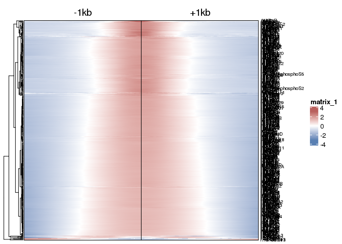
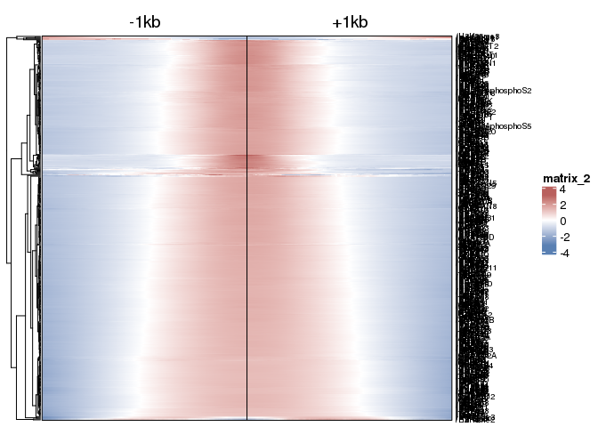
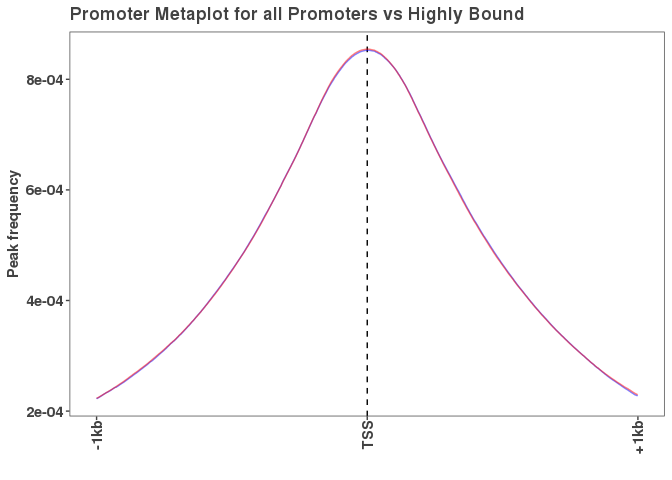

Genome-wide DNA binding in HEPG2
================
Abby Hein, Lisa Hansen, David Engelhardt
4/17/2022

# Goal:

Here we aim to download all available DNA binding protein (DBP) profiles
in a single cell state (measured by ChIP-seq) . This will allow us to
investigate the binding properties of hundreds of DBPs in the same
cellular context or background. We aim to address several questions: (i)
What are the number of peaks and genome coverage for each DBP? (ii) What
are the binding preferences for promoters, gene-bodies and intergenic
genomic regions? (iii) What are the similarities and differences across
DBPs based on their genome-wide binding profiles genome-wide? (iv) What
properties or preferences do promoters have for binding events. (iv) Are
there reservoir promoters in HepG2 as defined in k562 previously? (v)
How does binding to a promoter affect the transcriptional output of that
promoter?

To address these questions we have curated a set of X,000 ChIPs-eq data
sets comprised of 486 DBPs in HEPG2 cells from the ENCODE consortrium.
We required duplicate ChIP-seq experiments for a given DBP and other
criterion that can be found here :

<https://www.encodeproject.org/report/?type=Experiment&status=released&assay_slims=DNA+binding&biosample_ontology.term_name=HepG2&assay_title=TF+ChIP-seq&biosample_ontology.classification=cell+line&files.read_length=100&files.read_length=76&files.read_length=75&files.read_length=36&assay_title=Control+ChIP-seq&assay_title=Histone+ChIP-seq&files.run_type=single-ended>

## These samples were selected on the following criteria:

1.  “chromatin” interaction data, then DNA binding data, cell line
    HEPG2, “TF-Chip-seq”.
2.  We further selected “TF Chip-seq”, “Control chip-seq” and “Histone
    Chip-seq”.
3.  We selected several read lengths to get the most DNA binding
    proteins (DBPs)
4.  Read lengths: 100, 76, 75, 36
5.  ONLY SINGLE END READS (this eliminates 54 samples)

### Experimental data was downloading by (ENCODE report.tsv):

<https://www.encodeproject.org/report.tsv?type=Experiment&status=released&assay_slims=DNA+binding&biosample_ontology.term_name=HepG2&assay_title=TF+ChIP-seq&biosample_ontology.classification=cell+line&files.read_length=100&files.read_length=76&files.read_length=75&files.read_length=36&assay_title=Control+ChIP-seq&assay_title=Histone+ChIP-seq&files.run_type=single-ended>

### The FASTQ files were downloaded with:

“<https://www.encodeproject.org/metadata/?status=released&assay_slims=DNA+binding&biosample_ontology.term_name=HepG2&assay_title=TF+ChIP-seq&biosample_ontology.classification=cell+line&files.read_length=100&files.read_length=76&files.read_length=75&files.read_length=36&assay_title=Control+ChIP-seq&assay_title=Histone+ChIP-seq&files.run_type=single-ended&type=Experiment>”

MD5sums were checked with all passing (see encode\_file\_info function
to reterive MD5Sum values that are not available from the encode portal
(/util)

### Processing data:

We processed all the read alignments and peak calling using the NF\_CORE
ChIP-seq pipeline: (nfcore/chipseq v1.2.1)

## Next we created consensus peaks that overlap in both replicates

Our strategy was to take peaks in each replicate and find all
overlapping peak windows. We then took the union length of the
overlapping range in each peak window.

``` r
# create_consensus_peaks requires an annotation .GTF file - loading in Gencode v32 annotations.
gencode_gr <- rtracklayer::import("/scratch/Shares/rinnclass/CLASS_2022/data/genomes/gencode.v32.annotation.gtf")

# Creating consensus peaks function to create a .bed file of overlapping peaks in each replicate.
# /util/intersect_functions.R

# TODO run this only on final knit
#create_consensus_peaks <- create_consensus_peaks(broadpeakfilepath = "/scratch/Shares/rinnclass/CLASS_2022/data/test_work/all_peak_files")

# exporting consensus peaks .bed files

# TODO run this only on final knit
# for(i in 1:length(consensus_peaks)) {
#  rtracklayer::export(consensus_peaks[[i]],
#                     paste0("/scratch/Shares/rinnclass/CLASS_2022/JR/CLASS_2022/class_exeRcises/analysis/11_consensus_peaks/consensus_peaks/",
#                             names(consensus_peaks)[i],
#                             "_consensus_peaks.bed"))
# }
```

# loading in consensus peaks to prevent rerunning create\_consensus\_peaks function

``` r
# Loading in files via listing and rtracklayer import
consensus_fl <- list.files("/scratch/Shares/rinnclass/CLASS_2022/abbyHein/CLASS_2022/class_exeRcises/analysis/11_consensus_peaks/consensus_peaks/", full.names = T)

# importing (takes ~5min)
consensus_peaks <- lapply(consensus_fl, rtracklayer::import)

# cleaning up file names
names(consensus_peaks) <- gsub("/scratch/Shares/rinnclass/CLASS_2022/abbyHein/CLASS_2022/class_exeRcises/analysis/11_consensus_peaks/consensus_peaks/|_consensus_peaks.bed","", consensus_fl)

# Filtering consensus peaks to those DBPs with at least 250 peaks
num_peaks_threshold <- 250
num_peaks <- sapply(consensus_peaks, length)
filtered_consensus_peaks <- consensus_peaks[num_peaks > num_peaks_threshold]

# Result: these were the DBPs that were filtered out.
filtered_dbps <- consensus_peaks[num_peaks < num_peaks_threshold]
names(filtered_dbps)
```

    ##  [1] "/CEBPZ"    "/GPBP1L1"  "/H3K27me3" "/HMGA1"    "/IRF3"     "/MLLT10"  
    ##  [7] "/MYBL2"    "/NCOA5"    "/RNF219"   "/RORA"     "/ZBTB3"    "/ZFP36"   
    ## [13] "/ZFP62"    "/ZMAT5"    "/ZNF10"    "/ZNF17"    "/ZNF260"   "/ZNF382"  
    ## [19] "/ZNF48"    "/ZNF484"   "/ZNF577"   "/ZNF597"   "/ZNF7"

``` r
# We have this many remaining DBPs
length(filtered_consensus_peaks)
```

    ## [1] 460

## Now we will determine the peak number and genome coverage for each DBP.

``` r
# Let's start with loading in the number of peaks each DBP has -- using length.
num_peaks_df <- data.frame("dbp" = names(filtered_consensus_peaks),
                           "num_peaks" = sapply(filtered_consensus_peaks, length))

# total genomic coverage of peaks for each dbp
num_peaks_df$total_peak_length <- sapply(filtered_consensus_peaks, function(x) sum(width(x)))

# Plotting distribution of peak number per dbp
hist(num_peaks_df$total_peak_length)
```

<!-- -->

# Now we will create promoter annotations for lncRNA and mRNA and both.

We have created a function get\_promoter\_regions that has up and
downstream parameters, which are specified here as 1kb away from the TSS
(denoted as upstream or downstream)

``` r
# creating lncRNA and mRNA promoters
lncrna_mrna_promoters <- get_promoter_regions(gencode_gr, biotype = c("lncRNA", "protein_coding", upstream = 1000, downstream = 1000))
names(lncrna_mrna_promoters) <- lncrna_mrna_promoters$gene_id
rtracklayer::export(lncrna_mrna_promoters, "analysis/results/lncRNA_mrna_promoters.gtf")

# creating lncRNAs promoter
lncrna_promoters <- get_promoter_regions(gencode_gr, biotype = "lncRNA", upstream = 1000, downstream = 1000) 
names(lncrna_promoters) <- lncrna_promoters$gene_id
rtracklayer::export(lncrna_promoters, "/scratch/Shares/rinnclass/CLASS_2022/abbyHein/BCHM4631_abbyHein/analysis/results/lncRNA_promoters.gtf")

# creating mRNA promoters
mrna_promoters <- get_promoter_regions(gencode_gr, biotype = "protein_coding", upstream = 1000, downstream = 1000)
names(mrna_promoters) <- mrna_promoters$gene_id
rtracklayer::export(lncrna_promoters, "/scratch/Shares/rinnclass/CLASS_2022/abbyHein/BCHM4631_abbyHein/analysis/results/mRNA_promoters.gtf")

# creating all genebody annotation
lncrna_mrna_genebody <- gencode_gr[gencode_gr$type == "gene" & 
                                     gencode_gr$gene_type %in% c("lncRNA", "protein_coding")]
names(lncrna_mrna_genebody) <- lncrna_mrna_genebody$gene_id
rtracklayer::export(lncrna_mrna_genebody, "/scratch/Shares/rinnclass/CLASS_2022/abbyHein/BCHM4631_abbyHein/analysis/results/lncrna_mrna_genebody.gtf")

# creating lncRNA genebody annotation
lncrna_genebody <- gencode_gr[gencode_gr$type == "gene" & 
                                gencode_gr$gene_type %in% c("lncRNA")]
names(lncrna_genebody) <- lncrna_genebody$gene_id
rtracklayer::export(lncrna_mrna_genebody, "/scratch/Shares/rinnclass/CLASS_2022/abbyHein/BCHM4631_abbyHein/analysis/results/lncrna_genebody.gtf")

# creating mRNA genebody annotation
mrna_genebody <- gencode_gr[gencode_gr$type == "gene" & 
                              gencode_gr$gene_type %in% c("protein_coding")]
names(mrna_genebody) <-mrna_genebody$gene_id
rtracklayer::export(lncrna_mrna_genebody, "/scratch/Shares/rinnclass/CLASS_2022/abbyHein/BCHM4631_abbyHein/analysis/results/mrna_genebody.gtf")
```

# Now we will look at whether the same trends emerge when looking at DBPs based on number of binding partners

The 460 DBPs (found in num\_peaks\_df) were filtered through string to
create a map and associated node list (DBP\_node.tsv) The DBPs were then
grouped based on number of nodes and used to create separate dfs 1)
isolated = 0 2) low = 1-14 3) mid = 15-19 4) high = 20+

``` r
#read in tsv with nodes for each DBP
dbp_node_df <- read_tsv("/scratch/Shares/rinnclass/CLASS_2022/abbyHein/BCHM4631_abbyHein/analysis/results/DBP_node.tsv")
#cleaning up naming of DBPs
dbp_node_df$dbp<-sub("^","/",dbp_node_df$dbp)
#read in csv with data for each DBP
num_peaks_df <- read.csv("/scratch/Shares/rinnclass/CLASS_2022/abbyHein/BCHM4631_abbyHein/analysis/results/num_peaks_df.csv")
#combined the nodes with the num_peaks_df based on dbp
merge_test <- merge.data.frame(num_peaks_df, dbp_node_df, by ="dbp", all.x = TRUE)
#group DBPs based on number of binding partners quantified by the nodes 
merge_test <- merge_test %>%
  mutate(node_class = ifelse(node_degree ==0, "Isolated", ifelse(between(node_degree, 0,15), "Low", ifelse(between(node_degree, 14, 20), "Mid", ifelse(node_degree >19, "High", NA)))))
#create a df for each grouping based on nodes
num_peaks_df_isolated <- dplyr::filter(merge_test, node_class == "Isolated")
num_peaks_df_Low <- dplyr::filter(merge_test, node_class == "Low")
num_peaks_df_Mid <- dplyr::filter(merge_test, node_class == "Mid")
num_peaks_df_High <- dplyr::filter(merge_test, node_class == "High")
```

# Plotting peak annotation features for DBPs for all proteins and for groupings based on number of binding partners

First we will plot the distribution of the number of peaks per DBP

``` r
num_peaks_df <- read_csv("/scratch/Shares/rinnclass/CLASS_2022/abbyHein/BCHM4631_abbyHein/analysis/results/num_peaks_df.csv")
# Distribution of peak numbers of all 460 DBPs
ggplot(num_peaks_df, aes(x = num_peaks)) + 
  geom_histogram(bins = 70)
```

<!-- -->

``` r
summary(num_peaks_df$num_peaks)
```

    ##    Min. 1st Qu.  Median    Mean 3rd Qu.    Max. 
    ##     261    5643   15736   21524   32053  144675

``` r
# Distribution of peak numbers of DBPs with 0 binding partners 
ggplot(num_peaks_df_isolated, aes(x = num_peaks)) + 
  geom_histogram(bins = 70)
```

<!-- -->

``` r
summary(num_peaks_df_isolated$num_peaks)
```

    ##    Min. 1st Qu.  Median    Mean 3rd Qu.    Max. 
    ##     261    3726   12215   19648   25518  144675

``` r
# Distribution of peak numbers of DBPs with 1-14 binding partners 
ggplot(num_peaks_df_Low, aes(x = num_peaks)) + 
  geom_histogram(bins = 70)
```

<!-- -->

``` r
summary(num_peaks_df_Low$num_peaks)
```

    ##    Min. 1st Qu.  Median    Mean 3rd Qu.    Max. 
    ##     266    6772   17688   22424   34159   96050

``` r
# Distribution of peak numbers of DBPs with 15-19 binding partners 
ggplot(num_peaks_df_Mid, aes(x = num_peaks)) + 
  geom_histogram(bins = 70)
```

<!-- -->

``` r
summary(num_peaks_df_Mid$num_peaks)
```

    ##    Min. 1st Qu.  Median    Mean 3rd Qu.    Max. 
    ##    1791   12374   24438   26982   42241   70413

``` r
# Distribution of peak numbers of DBPs with 20+ binding partners 
ggplot(num_peaks_df_High, aes(x = num_peaks)) + 
  geom_histogram(bins = 70)
```

<!-- -->

``` r
summary(num_peaks_df_High$num_peaks)
```

    ##    Min. 1st Qu.  Median    Mean 3rd Qu.    Max. 
    ##     266    3912   12151   18321   26671   82689

# Determining the overlaps of chip peaks with promoters and genebodys

``` r
# creating index to subset lncRNA and mRNA annotations
lncrna_gene_ids <- lncrna_mrna_genebody$gene_id[lncrna_mrna_genebody$gene_type == "lncRNA"]
mrna_gene_ids <- lncrna_mrna_genebody$gene_id[lncrna_mrna_genebody$gene_type == "protein_coding"]

# using count peaks per feature returns number of annotation overlaps for a given DBP (takes ~5min)
promoter_peak_counts <- count_peaks_per_feature(lncrna_mrna_promoters, filtered_consensus_peaks, type = "counts")

# adding data to num_peaks_df
num_peaks_df$peaks_overlapping_promoters <- rowSums(promoter_peak_counts)
num_peaks_df$peaks_overlapping_lncrna_promoters <- rowSums(promoter_peak_counts[,lncrna_gene_ids])
num_peaks_df$peaks_overlapping_mrna_promoters <- rowSums(promoter_peak_counts[,mrna_gene_ids])

# gene body overlaps 
genebody_peak_counts <- count_peaks_per_feature(lncrna_mrna_genebody, 
                                                filtered_consensus_peaks, 
                                                type = "counts")


# adding data to num_peaks_df
num_peaks_df$peaks_overlapping_genebody <- rowSums(genebody_peak_counts)
num_peaks_df$peaks_overlapping_lncrna_genebody <- rowSums(genebody_peak_counts[,lncrna_gene_ids])
num_peaks_df$peaks_overlapping_mrna_genebody <- rowSums(genebody_peak_counts[,mrna_gene_ids])

write_csv(num_peaks_df, "/scratch/Shares/rinnclass/CLASS_2022/abbyHein/BCHM4631_abbyHein/analysis/results/num_peaks_df.csv")
```

The median number of peaks is nearly 16,000, but most DBPs tend to have
many fewer binding events. The distribution looks like an exponential
decay. Surprisingly, one DBP has nearly 150,000 peaks.

# Plotting the total genome coverage of each DBPs ChIP peaks

Here we want to see the relationship between the number of peaks and
amount of genome covered for all DBPs and for DBPs grouped by binding

``` r
# Plotting number of peaks versus total genome coverage
ggplot(num_peaks_df, aes(x = num_peaks, y = total_peak_length)) +
  geom_point() + 
  geom_smooth(method = "gam", se = TRUE, color = "black", lty = 2)+
         
  ylab("BP covered") +
  xlab("Number of peaks") +
  ggtitle("Peak count vs. total bases covered")
```

<!-- -->

``` r
ggsave("/scratch/Shares/rinnclass/CLASS_2022/abbyHein/BCHM4631_abbyHein/analysis/figures/peak_num_vs_coverage.pdf")

# Plotting number of peaks versus total genome coverage for isolated binders
ggplot(num_peaks_df_isolated, aes(x = num_peaks, y = total_peak_length)) +
  geom_point() + 
  geom_smooth(method = "gam", se = TRUE, color = "black", lty = 2)+
         
  ylab("BP covered") +
  xlab("Number of peaks") +
  ggtitle("Peak count vs. total bases covered for isolated binders")
```

<!-- -->

``` r
ggsave("/scratch/Shares/rinnclass/CLASS_2022/abbyHein/BCHM4631_abbyHein/analysis/figures/peak_num_vs_coverage_isolated.pdf")

# Plotting number of peaks versus total genome coverage for low binders
ggplot(num_peaks_df_Low, aes(x = num_peaks, y = total_peak_length)) +
  geom_point() + 
  geom_smooth(method = "gam", se = TRUE, color = "black", lty = 2)+
         
  ylab("BP covered") +
  xlab("Number of peaks") +
  ggtitle("Peak count vs. total bases covered for low binders")
```

<!-- -->

``` r
ggsave("/scratch/Shares/rinnclass/CLASS_2022/abbyHein/BCHM4631_abbyHein/analysis/figures/peak_num_vs_coverage_low.pdf")

# Plotting number of peaks versus total genome coverage for mid binders
ggplot(num_peaks_df_Mid, aes(x = num_peaks, y = total_peak_length)) +
  geom_point() + 
  geom_smooth(method = "gam", se = TRUE, color = "black", lty = 2)+
         
  ylab("BP covered") +
  xlab("Number of peaks") +
  ggtitle("Peak count vs. total bases covered for mid binders")
```

<!-- -->

``` r
ggsave("/scratch/Shares/rinnclass/CLASS_2022/abbyHein/BCHM4631_abbyHein/analysis/figures/peak_num_vs_coverage_mid.pdf")

# Plotting number of peaks versus total genome coverage for high binders
ggplot(num_peaks_df_High, aes(x = num_peaks, y = total_peak_length)) +
  geom_point() + 
  geom_smooth(method = "gam", se = TRUE, color = "black", lty = 2)+
         
  ylab("BP covered") +
  xlab("Number of peaks") +
  ggtitle("Peak count vs. total bases covered for high binders")
```

<!-- -->

``` r
ggsave("/scratch/Shares/rinnclass/CLASS_2022/abbyHein/BCHM4631_abbyHein/analysis/figures/peak_num_vs_coverage_high.pdf")
```

We observe a somewhat linear relationship between peak number and genome
coverage when looking at all DBPs Thus, more peaks = more genome
coverage. This could be interpreted as the peak sizes are typically
uniform and thus linearly increase genome coverage When categorizing the
DBPs based on number of binding partners, the trend seemed fairly
consistent with looking at all 460 proteins, each group exhibited a
relationship that appeared to be somewhat linear, though there were
slight variations within each group. Specifically the binders in the mid
group had that most variation from the line of best fit for both peak
count and bases covered. The low looked very similar to the whole group
plot, and the high and isolated binders had slightly different shaped
lines of best fit. Overall, each showcased that more peaks = more genome
coverage

# Plotting number of peaks versus overlaps with promoters

Here we are comparing the number of peaks for a given DBP to the total
number of promoters those peaks overlap for all DBPs and for DBPs
grouped by binding

``` r
# Plotting number of peaks versus peaks overlapping promoters for all DBPs
ggplot(num_peaks_df,
       aes(x = num_peaks, y = peaks_overlapping_promoters)) +
  xlab("Peaks per DBP") +
  ylab("Number of peaks overlapping promoters") +
  ggtitle("Relationship Between Number of DBP Peaks and Promoter Overlaps")+
  geom_point() +
  geom_abline(slope = 1, linetype="dashed") +
  geom_smooth(method = "lm", se=FALSE, formula = 'y ~ x',
              color = "#a8404c") +
  stat_regline_equation(label.x = 35000, label.y = 18000) +
  ylim(0,60100) +
  xlim(0,60100)
```

<!-- -->

``` r
ggsave("/scratch/Shares/rinnclass/CLASS_2022/abbyHein/BCHM4631_abbyHein/analysis/figures/3_peak_num_vs_promoter_coverage.pdf")

# Plotting number of peaks versus peaks overlapping promoters for isolated binders
ggplot(num_peaks_df_isolated,
       aes(x = num_peaks, y = peaks_overlapping_promoters)) +
  xlab("Peaks per DBP") +
  ylab("Number of peaks overlapping promoters") +
  ggtitle("Relationship Between Number of DBP Peaks and Promoter Overlaps for isolated binders")+
  geom_point() +
  geom_abline(slope = 1, linetype="dashed") +
  geom_smooth(method = "lm", se=FALSE, formula = 'y ~ x',
              color = "#a8404c") +
  stat_regline_equation(label.x = 35000, label.y = 18000) +
  ylim(0,60100) +
  xlim(0,60100)
```

<!-- -->

``` r
ggsave("/scratch/Shares/rinnclass/CLASS_2022/abbyHein/BCHM4631_abbyHein/analysis/figures/3_peak_num_vs_promoter_coverage_isolated.pdf")

# Plotting number of peaks versus peaks overlapping promoters for low binders
ggplot(num_peaks_df_Low,
       aes(x = num_peaks, y = peaks_overlapping_promoters)) +
  xlab("Peaks per DBP") +
  ylab("Number of peaks overlapping promoters") +
  ggtitle("Relationship Between Number of DBP Peaks and Promoter Overlaps for low binders")+
  geom_point() +
  geom_abline(slope = 1, linetype="dashed") +
  geom_smooth(method = "lm", se=FALSE, formula = 'y ~ x',
              color = "#a8404c") +
  stat_regline_equation(label.x = 35000, label.y = 18000) +
  ylim(0,60100) +
  xlim(0,60100)
```

<!-- -->

``` r
ggsave("/scratch/Shares/rinnclass/CLASS_2022/abbyHein/BCHM4631_abbyHein/analysis/figures/3_peak_num_vs_promoter_coverage_low.pdf")

# Plotting number of peaks versus peaks overlapping promoters for mid binders
ggplot(num_peaks_df_Mid,
       aes(x = num_peaks, y = peaks_overlapping_promoters)) +
  xlab("Peaks per DBP") +
  ylab("Number of peaks overlapping promoters") +
  ggtitle("Relationship Between Number of DBP Peaks and Promoter Overlaps for mid binders")+
  geom_point() +
  geom_abline(slope = 1, linetype="dashed") +
  geom_smooth(method = "lm", se=FALSE, formula = 'y ~ x',
              color = "#a8404c") +
  stat_regline_equation(label.x = 35000, label.y = 18000) +
  ylim(0,60100) +
  xlim(0,60100)
```

<!-- -->

``` r
ggsave("/scratch/Shares/rinnclass/CLASS_2022/abbyHein/BCHM4631_abbyHein/analysis/figures/3_peak_num_vs_promoter_coverage_mid.pdf")

# Plotting number of peaks versus peaks overlapping promoters for high binders
ggplot(num_peaks_df_High,
       aes(x = num_peaks, y = peaks_overlapping_promoters)) +
  xlab("Peaks per DBP") +
  ylab("Number of peaks overlapping promoters") +
  ggtitle("Relationship Between Number of DBP Peaks and Promoter Overlaps for high binders")+
  geom_point() +
  geom_abline(slope = 1, linetype="dashed") +
  geom_smooth(method = "lm", se=FALSE, formula = 'y ~ x',
              color = "#a8404c") +
  stat_regline_equation(label.x = 35000, label.y = 18000) +
  ylim(0,60100) +
  xlim(0,60100)
```

<!-- -->

``` r
ggsave("/scratch/Shares/rinnclass/CLASS_2022/abbyHein/BCHM4631_abbyHein/analysis/figures/3_peak_num_vs_promoter_coverage_high.pdf")
```

There is not a great linear fit across all the data. We observe that
below 20,000 peaks there seems to be a linear relationship however as
the peak number increases fewer promoters are overlapping. This suggests
that after 20,000 peaks most promoters are covered and now the peaks are
elsewhere. All of the subsets of proteins based on number of binding
partners displayed the same trend.

# Peaks per DBP overlaps with genebody

Here we want to see how many of the peaks for each DBP overlap
genebodys.

``` r
# Plotting peak overlaps with genebody
ggplot(num_peaks_df,
       aes(x = num_peaks, y = peaks_overlapping_genebody)) +
  xlab("Peaks per DBP") +
  ylab("Number of peaks overlapping genes") +
  ggtitle("Relationship Between Number of DBP Peaks and Gene Body Overlaps")+
  geom_point() +
  geom_abline(slope = 1, linetype="dashed") +
  geom_smooth(method = "lm", se=F, formula = 'y ~ x',
              color = "#a8404c") +
  stat_regline_equation(label.x = 35000, label.y = 18000) +
  ylim(0,60100) +
  xlim(0,60100)
```

<!-- -->

``` r
ggsave("/scratch/Shares/rinnclass/CLASS_2022/abbyHein/BCHM4631_abbyHein/analysis/figures/4_peak_num_vs_gene_body_coverage.pdf")
```

We observe that there is a very linear relationship between peak number
and genebody overlap. This means that the more peaks you have the more
likely you are to overlap a genebody. One way to think about this is
that genebody overlaps explains most of the peaks – or most peaks
overlap genebodys. We would expect dots (DBPs) that are below the line
are binding outside genebodys.

However, one artifact could be if genebodys take up most of the genome
this would also make a linear trend.

# Determing how much of the genome is comprised of genebodies.

``` r
# there is a large amount of data explained (almost all by genebodys)
# Let's see what percentage of the genome genebodys cover:
reduced_gene_bodies <- gencode_gr[gencode_gr$type == "gene"] %>%
  GenomicRanges::reduce() %>%
  width() %>%
  sum()

# percentage of gene bodies in genome
reduced_gene_bodies/3.2e9
```

    ## [1] 0.589159

So we observe that genebodys do cover a lot of the genome. Since they
represent a majority of the genome we would expect a linear
relationship. Nonetheless we conclude that most peaks overlap genebodys.

# Counting the number of overlaps at each promoter

promoters are the cols and DBPs rows thus we can retrieve the number of
binding events at each promoter unlike the “counts parameter” that just
gives total number of overlaps

``` r
# Creating matrix of promoters(annotation feature) as cols and DBPs as rows (takes ~5min)
promoter_peak_occurence <- count_peaks_per_feature(lncrna_mrna_promoters, filtered_consensus_peaks, 
                                               type = "occurrence")

# test to make sure everything is in right order
stopifnot(all(colnames(promoter_peak_occurence) == lncrna_mrna_promoters$gene_id))

# Formatting final data.frame from peak occurence matrix
peak_occurence_df <- data.frame("gene_id" = colnames(promoter_peak_occurence),
                                "gene_name" = lncrna_mrna_promoters$gene_name,
                                "gene_type" = lncrna_mrna_promoters$gene_type,
                                "chr" = lncrna_mrna_promoters@seqnames,   
                                "1_kb_up_tss_start" = lncrna_mrna_promoters@ranges@start,
                                "strand" = lncrna_mrna_promoters@strand,
                                "number_of_dbp" = colSums(promoter_peak_occurence))
# exporting
write_csv(peak_occurence_df, "/scratch/Shares/rinnclass/CLASS_2022/abbyHein/BCHM4631_abbyHein/analysis/results/peak_occurence_dataframe.csv")
```

# Plotting

Here we are going to plot the distribution of the number of DBPs on a
given promoter

``` r
ggplot(peak_occurence_df, aes(x = number_of_dbp)) +
geom_density(alpha = 0.2, color = "#424242", fill = "#424242") +
  
  theme_paperwhite() +
  xlab(expression("Number of DBPs")) +
  ylab(expression("Density")) +
  ggtitle("Promoter binding events",
          subtitle = "mRNA and lncRNA genes") 
```

<!-- -->

``` r
ggsave("/scratch/Shares/rinnclass/CLASS_2022/abbyHein/BCHM4631_abbyHein/analysis/figures/num_binding_events_per_promoter.pdf")
```

We observe a bimodal distribution of binding at promoters. This
indicates that there are two types of promoters: 1) Those that have up
to 70 or so DBPs bound 2) High binders that have more than 200 DBPs We
note a lag between 100-200 DBPs per promoter. This could indicate that
this is not a preferable number of DBPs.

# Multiple promoter window sizes

Let’s iterate over promoter window sizes and see if this effect is
maintained. First we’ll generate promoter windows of multiple

``` r
# Window sizes we want to iterate over.
window_size <- c(10, 30, 50, 100, 500, 1000, 1500, 2000, 2500, 3000)

# To test this function quickly, we'll subset gencode to a sampling of genes
gene_samples <- gencode_gr[gencode_gr$type == "gene"]
gene_samples <- gene_samples[gene_samples$gene_type %in% c("lncRNA", "protein_coding")]
gene_samples <- gene_samples[sample(1:length(gene_samples), 1000)]

promoter_list <- lapply(window_size, function(x) {
  GenomicRanges::promoters(gene_samples, upstream = x, downstream = x)
})
names(promoter_list) <- window_size

peaks_per_feature_list <- lapply(promoter_list, function(x) {
  count_peaks_per_feature(x, filtered_consensus_peaks, type = "occurrence")
})

num_dbp_list <- lapply(peaks_per_feature_list, function(x) {
  colSums(x)
})


for(i in 1:length(window_size)) {
  num_dbp_list[[i]] <- data.frame("gene_id" = names(num_dbp_list[[i]]),
                                  "num_dbp" = num_dbp_list[[i]],
                                  "window_size" = window_size[[i]])
}

num_dbp_df <- bind_rows(num_dbp_list)


ggplot(num_dbp_df, aes(x = num_dbp, color = window_size, group = window_size)) +
geom_density(alpha = 0.2) +
  theme_paperwhite() +
  xlab(expression("Number of DBPs")) +
  ylab(expression("Density")) +
  ggtitle("Promoter binding events",
          subtitle = "mRNA and lncRNA genes") 
```

<!-- -->

# Binding properties versus total RNA expression.

Let’s take a look at HEPG2 RNAseq downloaded from ENCODE. We will start
by loading in that data and then looking at the distribution of gene
expression and where to filter.

``` r
salmon_tpm <- read.csv("/scratch/Shares/rinnclass/CLASS_2022/JR/CLASS_2022/class_exeRcises/analysis/18_running_RNAseq_NF_CORE/preclass_NF_core_RUN/results/salmon/salmon_merged_gene_tpm.csv")

samplesheet <- read_rds("/scratch/Shares/rinnclass/CLASS_2022/JR/CLASS_2022/class_exeRcises/analysis/19_rnaseq/final_samplesheet.rds")

g2s <- read_csv("/scratch/Shares/rinnclass/CLASS_2022/JR/CLASS_2022/class_exeRcises/analysis/18_running_RNAseq_NF_CORE/g2s.csv") %>%
  dplyr::select(gene_id, gene_name)
```

# Organizing the loaded data into a nice data frame of TPM values.

``` r
# First we will take the mean TPM between replicates for total RNA (Homo_sapiens_hepg2).

tpm <- salmon_tpm %>% 
  pivot_longer(cols = 2:ncol(.), names_to = "sample_id", values_to = "tpm") %>%
  merge(samplesheet) %>%
  group_by(gene_id, condition) %>%
  summarize(tpm = mean(tpm, na.rm = T)) %>%
  filter(condition == "homo_sapiens_hepg2") %>%
  merge(g2s)

# Let's look at how many DBPs have a matching gene symbol in the gene expression dataset.
dbp_names <- tolower(num_peaks_df$dbp)
table(dbp_names %in% tolower(tpm$gene_name))
```

    ## 
    ## FALSE 
    ##   460

``` r
dbp_names[!(dbp_names %in% tolower(tpm$gene_name))]
```

    ##   [1] "/adnp"            "/aff4"            "/ahdc1"          
    ##   [4] "/ahr"             "/akap8"           "/akna"           
    ##   [7] "/arid3a"          "/arid4a"          "/arid4b"         
    ##  [10] "/arid5b"          "/arntl"           "/ash2l"          
    ##  [13] "/atad3a"          "/atf2"            "/atf3"           
    ##  [16] "/atf5"            "/atf6"            "/atf7"           
    ##  [19] "/atrx"            "/bcl3"            "/bcl6"           
    ##  [22] "/bhlhe40"         "/brca1"           "/brd4"           
    ##  [25] "/camta2"          "/cbfb"            "/cbx5"           
    ##  [28] "/cebpa"           "/cebpb"           "/cebpd"          
    ##  [31] "/cebpg"           "/cers6"           "/chd2"           
    ##  [34] "/creb3"           "/crem"            "/ctcf"           
    ##  [37] "/dbp"             "/ddit3"           "/dlx6"           
    ##  [40] "/dmap1"           "/dmtf1"           "/dnmt1"          
    ##  [43] "/dpf2"            "/drap1"           "/dzip1"          
    ##  [46] "/e2f1"            "/e2f2"            "/e2f4"           
    ##  [49] "/e2f5"            "/eea1"            "/eed"            
    ##  [52] "/egr1"            "/elf1"            "/elf3"           
    ##  [55] "/elf4"            "/elk1"            "/ep300"          
    ##  [58] "/erf"             "/esrra"           "/ets1"           
    ##  [61] "/etv5"            "/etv6"            "/ezh2"           
    ##  [64] "/fosl2"           "/foxa1"           "/foxa2"          
    ##  [67] "/foxa3"           "/foxj3"           "/foxk1"          
    ##  [70] "/foxm1"           "/foxo1"           "/foxp1"          
    ##  [73] "/foxp4"           "/fubp1"           "/fubp3"          
    ##  [76] "/gabpa"           "/gabpb1"          "/gata2"          
    ##  [79] "/gatad1"          "/gatad2a"         "/gli4"           
    ##  [82] "/gmeb1"           "/gmeb2"           "/gpn1"           
    ##  [85] "/gtf2f1"          "/gtf3a"           "/gzf1"           
    ##  [88] "/h3k27ac"         "/h3k36me3"        "/h3k4me1"        
    ##  [91] "/h3k4me2"         "/h3k4me3"         "/h3k9ac"         
    ##  [94] "/h3k9me3"         "/h4k20me1"        "/hcfc1"          
    ##  [97] "/hdac1"           "/hdac2"           "/hinfp"          
    ## [100] "/hivep1"          "/hmg20a"          "/hmg20b"         
    ## [103] "/hmgxb3"          "/hmgxb4"          "/hnf1a"          
    ## [106] "/hnf1b"           "/hnf4a"           "/hnf4g"          
    ## [109] "/homez"           "/hoxa3"           "/hoxa5"          
    ## [112] "/hoxd1"           "/hsf2"            "/ikzf4"          
    ## [115] "/ikzf5"           "/irf1"            "/irf2"           
    ## [118] "/irf5"            "/isl2"            "/isx"            
    ## [121] "/jun"             "/jund"            "/kat2b"          
    ## [124] "/kat7"            "/kat8"            "/kdm1a"          
    ## [127] "/kdm2a"           "/kdm3a"           "/kdm4b"          
    ## [130] "/kdm5b"           "/kdm6a"           "/kiaa2018"       
    ## [133] "/klf11"           "/klf12"           "/klf13"          
    ## [136] "/klf16"           "/klf6"            "/klf9"           
    ## [139] "/kmt2a"           "/kmt2b"           "/lbx2"           
    ## [142] "/lcor"            "/lcorl"           "/lin54"          
    ## [145] "/lrrfip1"         "/maf1"            "/maff"           
    ## [148] "/mafg"            "/mafk"            "/matr3"          
    ## [151] "/max"             "/maz"             "/mbd4"           
    ## [154] "/med1"            "/med13"           "/mef2a"          
    ## [157] "/mef2d"           "/mier2"           "/mier3"          
    ## [160] "/mixl1"           "/mlx"             "/mnx1"           
    ## [163] "/mta1"            "/mta3"            "/mtf1"           
    ## [166] "/mtf2"            "/mxd1"            "/mxd3"           
    ## [169] "/mxd4"            "/mxi1"            "/mynn"           
    ## [172] "/myrf"            "/naif1"           "/nfat5"          
    ## [175] "/nfatc3"          "/nfe2"            "/nfe2l1"         
    ## [178] "/nfe2l2"          "/nfia"            "/nfic"           
    ## [181] "/nfil3"           "/nfkb2"           "/nfkbiz"         
    ## [184] "/nfya"            "/nfyb"            "/nfyc"           
    ## [187] "/nkx3-1"          "/nr0b2"           "/nr2c2"          
    ## [190] "/nr2f1"           "/nr2f6"           "/nr3c1"          
    ## [193] "/nr5a1"           "/nrf1"            "/nrl"            
    ## [196] "/onecut1"         "/onecut2"         "/paf1"           
    ## [199] "/patz1"           "/pawr"            "/paxip1"         
    ## [202] "/phf20"           "/phf21a"          "/phf8"           
    ## [205] "/pitx1"           "/plscr1"          "/pogz"           
    ## [208] "/polr2a"          "/polr2aphosphos2" "/polr2aphosphos5"
    ## [211] "/pparg"           "/prdm10"          "/prdm15"         
    ## [214] "/preb"            "/rad21"           "/rara"           
    ## [217] "/rarg"            "/rbak"            "/rbpj"           
    ## [220] "/rcor1"           "/rcor2"           "/rela"           
    ## [223] "/rere"            "/rest"            "/rfx3"           
    ## [226] "/rfx5"            "/rfxank"          "/rfxap"          
    ## [229] "/rreb1"           "/rxra"            "/rxrb"           
    ## [232] "/safb2"           "/sap130"          "/satb2"          
    ## [235] "/setdb1"          "/sfpq"            "/sin3a"          
    ## [238] "/sin3b"           "/six1"            "/six4"           
    ## [241] "/smad1"           "/smad3"           "/smad4"          
    ## [244] "/smad9"           "/smc3"            "/snai1"          
    ## [247] "/snapc4"          "/sox13"           "/sox18"          
    ## [250] "/sox6"            "/sp1"             "/sp140l"         
    ## [253] "/sp2"             "/sp5"             "/spen"           
    ## [256] "/srf"             "/stag1"           "/stat5b"         
    ## [259] "/stat6"           "/suz12"           "/taf1"           
    ## [262] "/tbl1xr1"         "/tbp"             "/tbx2"           
    ## [265] "/tcf12"           "/tcf3"            "/tcf7l2"         
    ## [268] "/tead1"           "/tead3"           "/tead4"          
    ## [271] "/tef"             "/tfap4"           "/tfdp1"          
    ## [274] "/tfdp2"           "/tfe3"            "/thap11"         
    ## [277] "/thap8"           "/thap9"           "/thra"           
    ## [280] "/thrb"            "/tigd3"           "/tigd6"          
    ## [283] "/toe1"            "/tp53"            "/trafd1"         
    ## [286] "/tsc22d2"         "/ubtf"            "/usf1"           
    ## [289] "/usf2"            "/wiz"             "/xbp1"           
    ## [292] "/yeats2"          "/yeats4"          "/yy1"            
    ## [295] "/zbed4"           "/zbed5"           "/zbtb1"          
    ## [298] "/zbtb10"          "/zbtb14"          "/zbtb21"         
    ## [301] "/zbtb24"          "/zbtb25"          "/zbtb26"         
    ## [304] "/zbtb33"          "/zbtb38"          "/zbtb39"         
    ## [307] "/zbtb4"           "/zbtb42"          "/zbtb43"         
    ## [310] "/zbtb44"          "/zbtb46"          "/zbtb49"         
    ## [313] "/zbtb7a"          "/zbtb7b"          "/zbtb8a"         
    ## [316] "/zc3h4"           "/zc3h8"           "/zcchc11"        
    ## [319] "/zfp1"            "/zfp14"           "/zfp36l2"        
    ## [322] "/zfp37"           "/zfp41"           "/zfp64"          
    ## [325] "/zfp82"           "/zfy"             "/zgpat"          
    ## [328] "/zhx3"            "/zik1"            "/zkscan1"        
    ## [331] "/zkscan5"         "/zkscan8"         "/zmym3"          
    ## [334] "/znf101"          "/znf12"           "/znf124"         
    ## [337] "/znf138"          "/znf142"          "/znf143"         
    ## [340] "/znf180"          "/znf20"           "/znf205"         
    ## [343] "/znf217"          "/znf224"          "/znf225"         
    ## [346] "/znf230"          "/znf232"          "/znf234"         
    ## [349] "/znf25"           "/znf256"          "/znf263"         
    ## [352] "/znf264"          "/znf274"          "/znf276"         
    ## [355] "/znf280b"         "/znf280d"         "/znf281"         
    ## [358] "/znf296"          "/znf30"           "/znf317"         
    ## [361] "/znf318"          "/znf326"          "/znf331"         
    ## [364] "/znf333"          "/znf335"          "/znf337"         
    ## [367] "/znf33a"          "/znf33b"          "/znf34"          
    ## [370] "/znf343"          "/znf350"          "/znf362"         
    ## [373] "/znf367"          "/znf383"          "/znf384"         
    ## [376] "/znf407"          "/znf414"          "/znf432"         
    ## [379] "/znf44"           "/znf446"          "/znf451"         
    ## [382] "/znf460"          "/znf483"          "/znf485"         
    ## [385] "/znf490"          "/znf501"          "/znf503"         
    ## [388] "/znf510"          "/znf511"          "/znf512"         
    ## [391] "/znf512b"         "/znf513"          "/znf526"         
    ## [394] "/znf530"          "/znf543"          "/znf547"         
    ## [397] "/znf548"          "/znf549"          "/znf550"         
    ## [400] "/znf556"          "/znf557"          "/znf569"         
    ## [403] "/znf570"          "/znf572"          "/znf574"         
    ## [406] "/znf576"          "/znf580"          "/znf598"         
    ## [409] "/znf607"          "/znf608"          "/znf609"         
    ## [412] "/znf614"          "/znf615"          "/znf616"         
    ## [415] "/znf619"          "/znf629"          "/znf639"         
    ## [418] "/znf644"          "/znf652"          "/znf660"         
    ## [421] "/znf674"          "/znf678"          "/znf687"         
    ## [424] "/znf691"          "/znf697"          "/znf703"         
    ## [427] "/znf707"          "/znf709"          "/znf710"         
    ## [430] "/znf713"          "/znf720"          "/znf737"         
    ## [433] "/znf740"          "/znf761"          "/znf766"         
    ## [436] "/znf768"          "/znf772"          "/znf773"         
    ## [439] "/znf775"          "/znf776"          "/znf777"         
    ## [442] "/znf778"          "/znf781"          "/znf782"         
    ## [445] "/znf784"          "/znf786"          "/znf788"         
    ## [448] "/znf792"          "/znf800"          "/znf83"          
    ## [451] "/znf839"          "/znf883"          "/znf891"         
    ## [454] "/zscan20"         "/zscan22"         "/zscan29"        
    ## [457] "/zscan31"         "/zscan9"          "/zxdc"           
    ## [460] "/zzz3"

``` r
# There are 14 missing. It looks like it's mostly the histone modifactions -- which are not genes.

dbp_expression <- tpm %>% filter(tolower(gene_name) %in% dbp_names) %>%
  mutate(gene_name = tolower(gene_name))

# Final set of DBPs we can use between ENCODE names and TPM names from Salmon
# Making a data frame of DBPs we can use and TPM and overlaps
dbp_expression_vs_peak_number <- dbp_expression %>%
  left_join(num_peaks_df %>% dplyr::rename(gene_name = dbp) %>%
              mutate(gene_name = tolower(gene_name)))
```

# As a first check of the data let’s see how TPM relates to number of peaks

A reasonable hypothesis is that higher abundant proteins may have more
peaks.

``` r
ggplot(dbp_expression_vs_peak_number, aes(x = tpm, y = num_peaks)) +
  geom_point() +
  scale_y_log10() +
  xlim(0,50) +
  geom_smooth()
```

<!-- -->

# Loading in peak occurence DF we made above.

This data frame has all our peak info per DBP and we will merge TPM data
and other features. This way we have all the information we need for
watch promoter (rows)

``` r
# Loading in promoter peak occurence DF we made above (as matrix and converted to datframe)
# Around line 330
promoter_features_df <- read.csv("/scratch/Shares/rinnclass/CLASS_2022/JR/CLASS_2022/class_exeRcises/analysis/12_peak_features/peak_occurence_dataframe.csv")

# Merging int TPM values.
promoter_features_df <- promoter_features_df %>%
  left_join(tpm)
```

# Plotting number of DBPs (TFs) bound to a promoter versus expression of that promoter

``` r
ggplot(promoter_features_df, 
            aes(y = log2(tpm + 0.001), x = number_of_dbp, color = gene_type)) + 
geom_point(data = promoter_features_df %>% filter(tpm < 0.001),
             shape = 17, alpha = 0.7) +
  geom_smooth(method = 'gam', formula = y ~ s(x, bs = "cs")) +
  stat_cor() +
  scale_x_continuous(expand = c(0,0)) +
  scale_color_manual(values = c("#a8404c", "#424242"), name = "Gene type") + 
  ggtitle("Expression vs. promoter binding events") + 
  xlab(expression('Number of DBPs')) +
  ylab(expression(log[2](TPM))) 
```

<!-- -->

``` r
ggsave("/scratch/Shares/rinnclass/CLASS_2022/abbyHein/BCHM4631_abbyHein/analysis/figures/binding_versus_expression_all.pdf")
```

We find two patterns of promoter binding versus expression: 1)
Expression is linear with respect to number of binding events This is
similar to what has been published by Mele et al. Genome Research 2)
There is a population of promoters that are NOT expresed across the
range of bound DBPs

# Filtering by expression value.

We saw above that although there is a linear trend the expression values
are very low at promoters with less than 100 DBPs bound. Somewhere
around TPM of 0.04 which is very low!

Let’s look at the distribution of expression values to determine where
to filter. It seems common to filter as “expressed” if there is at least
one TPM.

# Plotting distribution of TPMS

``` r
ggplot(promoter_features_df, aes(x = tpm)) +
  geom_density() +
  xlim(0,2.5)
```

<!-- -->

We see that most genes have very low expression and we see an inflection
point in the density plot at around 0.25 TPM. Therefore, we’ll call any
gene with &gt; 0.25 TPM as expressed.

# Filtering to “expressed genes” &gt; 0.25 TPM

We will add this to promoter\_features\_df.

``` r
# making "expressed" col by filtering > .25
promoter_features_df <- promoter_features_df %>%
  mutate(expressed = tpm > 0.25)
table(promoter_features_df$expressed)
```

    ## 
    ## FALSE  TRUE 
    ## 17162 19550

If we make this cutoff, 19,550 genes are expressed. This is somewhat
typical \~50% of genes.

# Plotting number of expressed and not expressed genes

``` r
ggplot(promoter_features_df %>% filter(!is.na(tpm)), aes(x = expressed)) +
  geom_bar() +
  geom_text(stat='count', aes(label=..count..), vjust=-1)
```

\[\](Genome\_wide\_dna\_binding\_HEPG2\_files/figure-gfm/number of genes
“expressed” &gt; 0.25 TPM-1.png)<!-- --> \# Binding versus expression of
“expressed” genes Let’s look at the relationship between the number of
TFs on a promoter and the expression only for expressed genes.

``` r
ggplot(promoter_features_df %>% filter(expressed == TRUE), 
            aes(y = log2(tpm), x = number_of_dbp, color = gene_type)) + 
  geom_bin_2d() +
  geom_smooth(method = 'gam', formula = y ~ s(x, bs = "cs")) +
  stat_cor()
```

\[\](Genome\_wide\_dna\_binding\_HEPG2\_files/figure-gfm/binding versus
“expressed” genes-1.png)<!-- --> For expressed genes (TPM &gt; 0.25),
there is still a correlation between higher numbers of DBPs on the
promoter and the expression level. This trend carries through even very
high numbers of DBPs (&gt; 200). And more so for mRNAs than lncRNAs.

Surprisingly, there are genes which have no DBPs bound in this dataset,
but are still expressed. What are the gene types of these genes? Are
they transcribed by a different polymerase? Perhaps this highlights the
fact that although we have a large number of DBPs in this dataset, there
are still many other transcription factors not profiled. We have
approximately 1/3 of the total identified human TFs (460/1200).

# Determining Reservoirs

We previously published a phenomena of promoters bound by many DBPs but
do not follow the linear increase in expression at these promoters. We
will now do this for HEPG2 cells by determining:

Those promotoers with high binding (second mode) and lack expression TPM
&lt; 0.001

``` r
# reservoir defines as:
# greater than 100 DBPs bound at promoter
# less than 0.001 Tpm

promoter_features_df$hepg2_reservoir <- 
  as.numeric(promoter_features_df$number_of_dbp > 100 & 
               promoter_features_df$tpm < 0.001)
```

# merging in k562 reservoir information

``` r
# reading in file defining k562 reservoir 
k562_df <- read_csv("/scratch/Shares/rinnclass/CLASS_2022/data/2020_k562_promoter_peak_df.csv")

# organizing data frame
k562_df <- k562_df %>% 
  dplyr::select(gene_id, reservoir, conservative_reservoir, tpm, expression, tf_binding, promoter_mean_tpm, promoter_median_tpm, promoter_max_tpm) %>%
  dplyr::rename(k562_reservoir = reservoir, 
                k562_conservative_reservoir = conservative_reservoir,
                k562_expression = expression,
                k562_tpm = tpm,
                k562_tf_binding = tf_binding,
                k562_promoter_mean_tpm =  promoter_mean_tpm,
                k562_promoter_median_tpm = promoter_median_tpm,
                k562_promoter_median_tpm = promoter_median_tpm,
                k562_promoter_max_tpm = promoter_max_tpm)

# Hepg2_DF
hepg2_df <- promoter_features_df %>%
  dplyr::select(gene_id, gene_name, tpm, number_of_dbp, hepg2_reservoir) %>%
   dplyr::rename( hepg2_tpm = tpm)

# merging data frames
hepg2_k562_promoter_features_df <- merge(hepg2_df, k562_df)

# summarizing overlaps
res_status <- hepg2_k562_promoter_features_df %>% 
  group_by(hepg2_reservoir, k562_reservoir, k562_conservative_reservoir) %>%
  summarize(count = n())
```

# Defining high binder promoters

``` r
# look at distribution of binding events
summary(promoter_features_df$number_of_dbp)
```

    ##    Min. 1st Qu.  Median    Mean 3rd Qu.    Max. 
    ##     0.0     2.0    46.0   123.7   263.0   427.0

``` r
# based on this deifining > 230 as high, 11-229 as medium and 10 or less as low
promoter_features_df <- promoter_features_df %>%
  mutate(binding_status = ifelse(number_of_dbp > 230, "high",
                                 ifelse(number_of_dbp < 10, "low", "medium")),
         expression_level = ifelse(tpm > 100, "high", ifelse(tpm > 0.25, "medium", "low")))
promoter_features_df$binding_status <- factor(promoter_features_df$binding_status, 
                                              levels = c("low", "medium", "high"))
```

# High, medium and low binding promoters expression level

We will determine those genes that are expressed as &gt; 0.25 TPM per
above. Then plot the binding status of the promoters accordingly.

``` r
ggplot(promoter_features_df %>% filter(!is.na(expressed)), aes(x = binding_status)) +
  geom_bar() +
facet_wrap(~expressed)
```

<!-- -->

``` r
# number of expressed in each binding category
table(promoter_features_df$binding_status)
```

    ## 
    ##    low medium   high 
    ##  13831  11477  11506

# Subsecting promoter peak occurence by high and low binding promoters from above.

``` r
# promoters with more than 230 DBPs from peak occurence matrix
high_binding_promoters <- promoter_peak_occurence[,promoter_features_df %>%
                                                    filter(binding_status == "high") %>%
                                                    pull(gene_id)]

# promoters with less than 10 DBPs from peak occurence matrix
low_binding_promoters <- promoter_peak_occurence[,promoter_features_df %>%
                                                    filter(binding_status == "low") %>%
                                                    pull(gene_id)]

# percentage (occupancy) of promoters bound by each DBP
high_binding_occupancy <- rowSums(high_binding_promoters) / ncol(high_binding_promoters)

low_binding_occupancy <- rowSums(low_binding_promoters) / ncol(low_binding_promoters)

# combining into data.frame
binding_occupancy <- data.frame(dbp = names(high_binding_occupancy),
                                high = high_binding_occupancy,
                                low = low_binding_occupancy) %>%
  # ratio of occupancy on high versus low binding promoters
  mutate(high_vs_low_ratio = log2((high + 0.001) / (low + 0.001)))
```

# Plotting density of occupancy of DBPs on high and low binding promoters

``` r
# Density of DBPs occupancy on high binders
ggplot(binding_occupancy, aes(x = high)) +
  geom_density()
```

<!-- -->

``` r
# Density of DBPs occupancy on low binders
ggplot(binding_occupancy, aes(x = low)) +
  geom_density()
```

<!-- -->
We observe that on high binders most proteins that are bound are bound
to 75% or more of high binding promoters. Thus, if a DBP is bound to a
high binder it is bound to most of them or they have similar
populations.

In contrast, for lowly bound promoters very few DBPs are in common. Most
DBPs are bond to less than 5% of lowly bound promoters.

# Are there some DBPs that seperate the expressed vs not expressed high binding promoters?

This analysis will point us towards a possible repressor of high binding
promoters that results in lower expression despite high binding.

``` r
# subsecting promter_features to highly expressed and high binding status
high_binders <- promoter_features_df %>%
  filter(binding_status == "high")

# DBPs on high binders (hb)  and highly expressed 
expressed_hb <- promoter_peak_occurence[,high_binders %>%
                                                    filter(expression_level == "high") %>%
                                                    pull(gene_id)]

# DBPs on highbinders (hb) that are lowly expressed 
lowly_expressed_hb <- promoter_peak_occurence[,high_binders %>%
                                                    filter(expression_level == "low") %>%
                                                    pull(gene_id)]

# Percentage of DBP representation on expressed versus lowly expressed high binding promters
ehb_occupancy <- rowSums(expressed_hb) / ncol(expressed_hb)
lhb_occupancy <- rowSums(lowly_expressed_hb) / ncol(lowly_expressed_hb)
hb_binding_occupancy <- data.frame(dbp = names(ehb_occupancy),
                                high_exp = ehb_occupancy,
                                low_exp = lhb_occupancy ) %>%
  mutate(high_vs_low_ratio = log2((high_exp + 0.001) / (low_exp + 0.001)))
```

# Plotting DBP occupance on expressed versus lowly expressed high binding promoters

``` r
library(ggrepel)

ggplot(hb_binding_occupancy, aes(x = low_exp, y = high_vs_low_ratio, label = dbp)) +
  geom_point() +
  geom_text_repel(data = hb_binding_occupancy %>% filter(high_vs_low_ratio < -1)) +
  geom_text_repel(data = hb_binding_occupancy %>% filter(high_vs_low_ratio > 0.75)) +
  geom_smooth(method = "lm")
```

-1.png)<!-- -->
Interesting, we see that EZH2 is associated with low expression
promoters despite high binding. this makes sense since EZH2 is a
repressor of gene expression. However is only on a few of the lowly
expressed high binding promoters (\~10%).

Conversely, High binding - high expression promoters are neriches with
euchromatic complexes. This makes sense as these DBPs are known to be
associated with active genes.

# Testing for the discriminators for the polII positive promoters.

Based on the results above we hypothesize that Pol II would be a good
indicator of expression versus non expressed high binders.

``` r
polII_names <- rownames(promoter_peak_occurence)[grep("POLR", rownames(promoter_peak_occurence))]

# Let's add a column with PolII status to our data.frame
polII_counts <- colSums(promoter_peak_occurence[polII_names,])
polII_counts_df <- data.frame(gene_id = names(polII_counts),
                              polII_status = polII_counts)
polII_counts_df <- polII_counts_df[promoter_features_df$gene_id,]
promoter_features_df$polII_status <- polII_counts_df$polII_status

# Defining high binding 
high_binders <- promoter_features_df %>%
  filter(binding_status == "high")
```

``` r
# at least one Pol II bound high binder and highly expressed and Pol II low expressed
expressed_hb <- promoter_peak_occurence[,high_binders %>%
                                                    filter(expression_level == "high", polII_status > 1) %>%
                                                    pull(gene_id)]
lowly_expressed_hb <- promoter_peak_occurence[,high_binders %>%
                                                    filter(expression_level == "low", polII_status > 1) %>%
                                                    pull(gene_id)]

# percentage of promoters with Pol II and expressed high binders
ehb_occupancy <- rowSums(expressed_hb) / ncol(expressed_hb)

# percentage of promoters with Pol II and lowly expressed high binders
lhb_occupancy <- rowSums(lowly_expressed_hb) / ncol(lowly_expressed_hb)

hb_binding_occupancy <- data.frame(dbp = names(ehb_occupancy),
                                high_exp = ehb_occupancy,
                                low_exp = lhb_occupancy ) %>%
  mutate(high_vs_low_ratio = log2((high_exp + 0.001) / (low_exp + 0.001)))
library(ggrepel)
```

``` r
ggplot(hb_binding_occupancy, aes(x = high_exp, y = high_vs_low_ratio, label = dbp)) +
  geom_point() +
  geom_text_repel(data = hb_binding_occupancy %>% filter(high_vs_low_ratio < -0.5)) +
  geom_text_repel(data = hb_binding_occupancy %>% filter(high_vs_low_ratio > 0.75)) +
  geom_smooth(method = "lm")
```

<!-- -->

# How many genes are expressed but don’t have any DBPs bound

``` r
ggplot(promoter_features_df %>% 
         filter(number_of_dbp == 0, !is.na(tpm)), aes(x = expressed)) +
          geom_bar() +
          geom_text(stat='count', aes(label=..count..), vjust=-1) 
```

<!-- -->
This is probably explained that there is a different TSS that is bound –
we are using the longest isoform, but this may not be the one that is
active in this data. A better approach would be to do this on an isoform
level.

## ATAC-seq

Let’s look to see if there are differences in the number of ATAC-seq
peaks over the promoters with different amounts of DBPs.

``` r
# Download data:
# wget https://www.encodeproject.org/files/ENCFF536RJV/@@download/ENCFF536RJV.bed.gz

# Converting downloaded data to "bed" format via read.table
atac_peaks <- read.table("analysis/ENCFF536RJV.bed.gz",
                         col.names = c("chrom", "start", "end", "name", "score", 
                                       "strand", "signal_value", "pval", 
                                       "qval", "summit"))

# Crateing GRanges of ATAC peaks
atac_peaks_gr <- GRanges(seqnames = atac_peaks$chrom,
                         ranges = IRanges(start = atac_peaks$start,
                                          end = atac_peaks$end))
atac_peaks_list <- list(atac_peaks_gr)
names(atac_peaks_list) <- "atac"

# ATAC peaks that overlap with promoters
atac_promoter_ov <- count_peaks_per_feature(lncrna_mrna_promoters, atac_peaks_list, type = "counts")
atac_promoter_df <- atac_promoter_ov %>% 
  t() %>%
  as.data.frame() %>%
  rownames_to_column("gene_id")
```

# Plotting the distribution of ATAC peaks overlapping promoters.

``` r
ggplot(atac_promoter_df, aes(x = atac)) +
  geom_density(adjust = 1.9)
```

<!-- -->
We observe that there is a distribution of 1 or less and another peak
around 5 ATAC peaks overlapping a promoter.

``` r
promoter_features_df <- promoter_features_df %>%
  left_join(atac_promoter_df)
```

# Plotting ATAC peak overlaps versus number of DBPS bound

``` r
ggplot(promoter_features_df %>% filter(number_of_dbp > 100), aes(x = number_of_dbp, y = atac)) +
  geom_bin_2d() +
  geom_smooth() +
  stat_cor()
```

<!-- -->
We observe a slight but significant linear trend between \# atac peaks
and \# DBPs bound. This could lead us to hypothesize that ???

\#Meta plot to visualize where in promoter these proteins are binding
informed by the bimodal distribution To do so, make plot of all
promoters with dbps bound, mapping where binding occurs in a 1kb
windown, and then another that is a subset including all those promoters
with more than 150 binding sites

``` r
hi_boundPromoters <- peak_occurence_df[peak_occurence_df$number_of_dbp >= 150,]

High_bound_promoters <- subset(lncrna_mrna_promoters, lncrna_mrna_promoters@ranges@NAMES %in% hi_boundPromoters$gene_id)
High_bound_promoterstmp <- subset(mrna_promoters, mrna_promoters@ranges@NAMES %in% hi_boundPromoters$gene_id)

metaplot_df <- data.frame(x = integer(), dens = numeric(), dbp = character())

metaplot_df_hiBoundProm <- data.frame(x = integer(), dens = numeric(), dbp = character())


# Writting a for loop to calculate promoter coverage for all DBPs:

for(i in c(1:390, 392:length(filtered_consensus_peaks))) {
  # we skipped 391 as it breaks (only 19 peaks ?)
  print(names(filtered_consensus_peaks)[[i]])
  tmp_df <- profile_tss(filtered_consensus_peaks[[i]], promoters_gr = lncrna_mrna_promoters, upstream = 1e3, downstream = 1e3)
  tmp_df$dbp <- names(filtered_consensus_peaks)[[i]]
  metaplot_df <- bind_rows(metaplot_df, tmp_df)
}
```

    ## [1] "/ADNP"
    ## [1] "/AFF4"
    ## [1] "/AHDC1"
    ## [1] "/AHR"
    ## [1] "/AKAP8"
    ## [1] "/AKNA"
    ## [1] "/ARID3A"
    ## [1] "/ARID4A"
    ## [1] "/ARID4B"
    ## [1] "/ARID5B"
    ## [1] "/ARNTL"
    ## [1] "/ASH2L"
    ## [1] "/ATAD3A"
    ## [1] "/ATF2"
    ## [1] "/ATF3"
    ## [1] "/ATF5"
    ## [1] "/ATF6"
    ## [1] "/ATF7"
    ## [1] "/ATRX"
    ## [1] "/BCL3"
    ## [1] "/BCL6"
    ## [1] "/BHLHE40"
    ## [1] "/BRCA1"
    ## [1] "/BRD4"
    ## [1] "/CAMTA2"
    ## [1] "/CBFB"
    ## [1] "/CBX5"
    ## [1] "/CEBPA"
    ## [1] "/CEBPB"
    ## [1] "/CEBPD"
    ## [1] "/CEBPG"
    ## [1] "/CERS6"
    ## [1] "/CHD2"
    ## [1] "/CREB3"
    ## [1] "/CREM"
    ## [1] "/CTCF"
    ## [1] "/DBP"
    ## [1] "/DDIT3"
    ## [1] "/DLX6"
    ## [1] "/DMAP1"
    ## [1] "/DMTF1"
    ## [1] "/DNMT1"
    ## [1] "/DPF2"
    ## [1] "/DRAP1"
    ## [1] "/DZIP1"
    ## [1] "/E2F1"
    ## [1] "/E2F2"
    ## [1] "/E2F4"
    ## [1] "/E2F5"
    ## [1] "/EEA1"
    ## [1] "/EED"
    ## [1] "/EGR1"
    ## [1] "/ELF1"
    ## [1] "/ELF3"
    ## [1] "/ELF4"
    ## [1] "/ELK1"
    ## [1] "/EP300"
    ## [1] "/ERF"
    ## [1] "/ESRRA"
    ## [1] "/ETS1"
    ## [1] "/ETV5"
    ## [1] "/ETV6"
    ## [1] "/EZH2"
    ## [1] "/FOSL2"
    ## [1] "/FOXA1"
    ## [1] "/FOXA2"
    ## [1] "/FOXA3"
    ## [1] "/FOXJ3"
    ## [1] "/FOXK1"
    ## [1] "/FOXM1"
    ## [1] "/FOXO1"
    ## [1] "/FOXP1"
    ## [1] "/FOXP4"
    ## [1] "/FUBP1"
    ## [1] "/FUBP3"
    ## [1] "/GABPA"
    ## [1] "/GABPB1"
    ## [1] "/GATA2"
    ## [1] "/GATAD1"
    ## [1] "/GATAD2A"
    ## [1] "/GLI4"
    ## [1] "/GMEB1"
    ## [1] "/GMEB2"
    ## [1] "/GPN1"
    ## [1] "/GTF2F1"
    ## [1] "/GTF3A"
    ## [1] "/GZF1"
    ## [1] "/H3K27ac"
    ## [1] "/H3K36me3"
    ## [1] "/H3K4me1"
    ## [1] "/H3K4me2"
    ## [1] "/H3K4me3"
    ## [1] "/H3K9ac"
    ## [1] "/H3K9me3"
    ## [1] "/H4K20me1"
    ## [1] "/HCFC1"
    ## [1] "/HDAC1"
    ## [1] "/HDAC2"
    ## [1] "/HINFP"
    ## [1] "/HIVEP1"
    ## [1] "/HMG20A"
    ## [1] "/HMG20B"
    ## [1] "/HMGXB3"
    ## [1] "/HMGXB4"
    ## [1] "/HNF1A"
    ## [1] "/HNF1B"
    ## [1] "/HNF4A"
    ## [1] "/HNF4G"
    ## [1] "/HOMEZ"
    ## [1] "/HOXA3"
    ## [1] "/HOXA5"
    ## [1] "/HOXD1"
    ## [1] "/HSF2"
    ## [1] "/IKZF4"
    ## [1] "/IKZF5"
    ## [1] "/IRF1"
    ## [1] "/IRF2"
    ## [1] "/IRF5"
    ## [1] "/ISL2"
    ## [1] "/ISX"
    ## [1] "/JUN"
    ## [1] "/JUND"
    ## [1] "/KAT2B"
    ## [1] "/KAT7"
    ## [1] "/KAT8"
    ## [1] "/KDM1A"
    ## [1] "/KDM2A"
    ## [1] "/KDM3A"
    ## [1] "/KDM4B"
    ## [1] "/KDM5B"
    ## [1] "/KDM6A"
    ## [1] "/KIAA2018"
    ## [1] "/KLF11"
    ## [1] "/KLF12"
    ## [1] "/KLF13"
    ## [1] "/KLF16"
    ## [1] "/KLF6"
    ## [1] "/KLF9"
    ## [1] "/KMT2A"
    ## [1] "/KMT2B"
    ## [1] "/LBX2"
    ## [1] "/LCOR"
    ## [1] "/LCORL"
    ## [1] "/LIN54"
    ## [1] "/LRRFIP1"
    ## [1] "/MAF1"
    ## [1] "/MAFF"
    ## [1] "/MAFG"
    ## [1] "/MAFK"
    ## [1] "/MATR3"
    ## [1] "/MAX"
    ## [1] "/MAZ"
    ## [1] "/MBD4"
    ## [1] "/MED1"
    ## [1] "/MED13"
    ## [1] "/MEF2A"
    ## [1] "/MEF2D"
    ## [1] "/MIER2"
    ## [1] "/MIER3"
    ## [1] "/MIXL1"
    ## [1] "/MLX"
    ## [1] "/MNX1"
    ## [1] "/MTA1"
    ## [1] "/MTA3"
    ## [1] "/MTF1"
    ## [1] "/MTF2"
    ## [1] "/MXD1"
    ## [1] "/MXD3"
    ## [1] "/MXD4"
    ## [1] "/MXI1"
    ## [1] "/MYNN"
    ## [1] "/MYRF"
    ## [1] "/NAIF1"
    ## [1] "/NFAT5"
    ## [1] "/NFATC3"
    ## [1] "/NFE2"
    ## [1] "/NFE2L1"
    ## [1] "/NFE2L2"
    ## [1] "/NFIA"
    ## [1] "/NFIC"
    ## [1] "/NFIL3"
    ## [1] "/NFKB2"
    ## [1] "/NFKBIZ"
    ## [1] "/NFYA"
    ## [1] "/NFYB"
    ## [1] "/NFYC"
    ## [1] "/NKX3-1"
    ## [1] "/NR0B2"
    ## [1] "/NR2C2"
    ## [1] "/NR2F1"
    ## [1] "/NR2F6"
    ## [1] "/NR3C1"
    ## [1] "/NR5A1"
    ## [1] "/NRF1"
    ## [1] "/NRL"
    ## [1] "/ONECUT1"
    ## [1] "/ONECUT2"
    ## [1] "/PAF1"
    ## [1] "/PATZ1"
    ## [1] "/PAWR"
    ## [1] "/PAXIP1"
    ## [1] "/PHF20"
    ## [1] "/PHF21A"
    ## [1] "/PHF8"
    ## [1] "/PITX1"
    ## [1] "/PLSCR1"
    ## [1] "/POGZ"
    ## [1] "/POLR2A"
    ## [1] "/POLR2AphosphoS2"
    ## [1] "/POLR2AphosphoS5"
    ## [1] "/PPARG"
    ## [1] "/PRDM10"
    ## [1] "/PRDM15"
    ## [1] "/PREB"
    ## [1] "/RAD21"
    ## [1] "/RARA"
    ## [1] "/RARG"
    ## [1] "/RBAK"
    ## [1] "/RBPJ"
    ## [1] "/RCOR1"
    ## [1] "/RCOR2"
    ## [1] "/RELA"
    ## [1] "/RERE"
    ## [1] "/REST"
    ## [1] "/RFX3"
    ## [1] "/RFX5"
    ## [1] "/RFXANK"
    ## [1] "/RFXAP"
    ## [1] "/RREB1"
    ## [1] "/RXRA"
    ## [1] "/RXRB"
    ## [1] "/SAFB2"
    ## [1] "/SAP130"
    ## [1] "/SATB2"
    ## [1] "/SETDB1"
    ## [1] "/SFPQ"
    ## [1] "/SIN3A"
    ## [1] "/SIN3B"
    ## [1] "/SIX1"
    ## [1] "/SIX4"
    ## [1] "/SMAD1"
    ## [1] "/SMAD3"
    ## [1] "/SMAD4"
    ## [1] "/SMAD9"
    ## [1] "/SMC3"
    ## [1] "/SNAI1"
    ## [1] "/SNAPC4"
    ## [1] "/SOX13"
    ## [1] "/SOX18"
    ## [1] "/SOX6"
    ## [1] "/SP1"
    ## [1] "/SP140L"
    ## [1] "/SP2"
    ## [1] "/SP5"
    ## [1] "/SPEN"
    ## [1] "/SRF"
    ## [1] "/STAG1"
    ## [1] "/STAT5B"
    ## [1] "/STAT6"
    ## [1] "/SUZ12"
    ## [1] "/TAF1"
    ## [1] "/TBL1XR1"
    ## [1] "/TBP"
    ## [1] "/TBX2"
    ## [1] "/TCF12"
    ## [1] "/TCF3"
    ## [1] "/TCF7L2"
    ## [1] "/TEAD1"
    ## [1] "/TEAD3"
    ## [1] "/TEAD4"
    ## [1] "/TEF"
    ## [1] "/TFAP4"
    ## [1] "/TFDP1"
    ## [1] "/TFDP2"
    ## [1] "/TFE3"
    ## [1] "/THAP11"
    ## [1] "/THAP8"
    ## [1] "/THAP9"
    ## [1] "/THRA"
    ## [1] "/THRB"
    ## [1] "/TIGD3"
    ## [1] "/TIGD6"
    ## [1] "/TOE1"
    ## [1] "/TP53"
    ## [1] "/TRAFD1"
    ## [1] "/TSC22D2"
    ## [1] "/UBTF"
    ## [1] "/USF1"
    ## [1] "/USF2"
    ## [1] "/WIZ"
    ## [1] "/XBP1"
    ## [1] "/YEATS2"
    ## [1] "/YEATS4"
    ## [1] "/YY1"
    ## [1] "/ZBED4"
    ## [1] "/ZBED5"
    ## [1] "/ZBTB1"
    ## [1] "/ZBTB10"
    ## [1] "/ZBTB14"
    ## [1] "/ZBTB21"
    ## [1] "/ZBTB24"
    ## [1] "/ZBTB25"
    ## [1] "/ZBTB26"
    ## [1] "/ZBTB33"
    ## [1] "/ZBTB38"
    ## [1] "/ZBTB39"
    ## [1] "/ZBTB4"
    ## [1] "/ZBTB42"
    ## [1] "/ZBTB43"
    ## [1] "/ZBTB44"
    ## [1] "/ZBTB46"
    ## [1] "/ZBTB49"
    ## [1] "/ZBTB7A"
    ## [1] "/ZBTB7B"
    ## [1] "/ZBTB8A"
    ## [1] "/ZC3H4"
    ## [1] "/ZC3H8"
    ## [1] "/ZCCHC11"
    ## [1] "/ZFP1"
    ## [1] "/ZFP14"
    ## [1] "/ZFP36L2"
    ## [1] "/ZFP37"
    ## [1] "/ZFP41"
    ## [1] "/ZFP64"
    ## [1] "/ZFP82"
    ## [1] "/ZFY"
    ## [1] "/ZGPAT"
    ## [1] "/ZHX3"
    ## [1] "/ZIK1"
    ## [1] "/ZKSCAN1"
    ## [1] "/ZKSCAN5"
    ## [1] "/ZKSCAN8"
    ## [1] "/ZMYM3"
    ## [1] "/ZNF101"
    ## [1] "/ZNF12"
    ## [1] "/ZNF124"
    ## [1] "/ZNF138"
    ## [1] "/ZNF142"
    ## [1] "/ZNF143"
    ## [1] "/ZNF180"
    ## [1] "/ZNF20"
    ## [1] "/ZNF205"
    ## [1] "/ZNF217"
    ## [1] "/ZNF224"
    ## [1] "/ZNF225"
    ## [1] "/ZNF230"
    ## [1] "/ZNF232"
    ## [1] "/ZNF234"
    ## [1] "/ZNF25"
    ## [1] "/ZNF256"
    ## [1] "/ZNF263"
    ## [1] "/ZNF264"
    ## [1] "/ZNF274"
    ## [1] "/ZNF276"
    ## [1] "/ZNF280B"
    ## [1] "/ZNF280D"
    ## [1] "/ZNF281"
    ## [1] "/ZNF296"
    ## [1] "/ZNF30"
    ## [1] "/ZNF317"
    ## [1] "/ZNF318"
    ## [1] "/ZNF326"
    ## [1] "/ZNF331"
    ## [1] "/ZNF333"
    ## [1] "/ZNF335"
    ## [1] "/ZNF337"
    ## [1] "/ZNF33A"
    ## [1] "/ZNF33B"
    ## [1] "/ZNF34"
    ## [1] "/ZNF343"
    ## [1] "/ZNF350"
    ## [1] "/ZNF362"
    ## [1] "/ZNF367"
    ## [1] "/ZNF383"
    ## [1] "/ZNF384"
    ## [1] "/ZNF407"
    ## [1] "/ZNF414"
    ## [1] "/ZNF432"
    ## [1] "/ZNF44"
    ## [1] "/ZNF446"
    ## [1] "/ZNF451"
    ## [1] "/ZNF460"
    ## [1] "/ZNF483"
    ## [1] "/ZNF485"
    ## [1] "/ZNF490"
    ## [1] "/ZNF501"
    ## [1] "/ZNF503"
    ## [1] "/ZNF510"
    ## [1] "/ZNF511"
    ## [1] "/ZNF512"
    ## [1] "/ZNF513"
    ## [1] "/ZNF526"
    ## [1] "/ZNF530"
    ## [1] "/ZNF543"
    ## [1] "/ZNF547"
    ## [1] "/ZNF548"
    ## [1] "/ZNF549"
    ## [1] "/ZNF550"
    ## [1] "/ZNF556"
    ## [1] "/ZNF557"
    ## [1] "/ZNF569"
    ## [1] "/ZNF570"
    ## [1] "/ZNF572"
    ## [1] "/ZNF574"
    ## [1] "/ZNF576"
    ## [1] "/ZNF580"
    ## [1] "/ZNF598"
    ## [1] "/ZNF607"
    ## [1] "/ZNF608"
    ## [1] "/ZNF609"
    ## [1] "/ZNF614"
    ## [1] "/ZNF615"
    ## [1] "/ZNF616"
    ## [1] "/ZNF619"
    ## [1] "/ZNF629"
    ## [1] "/ZNF639"
    ## [1] "/ZNF644"
    ## [1] "/ZNF652"
    ## [1] "/ZNF660"
    ## [1] "/ZNF674"
    ## [1] "/ZNF678"
    ## [1] "/ZNF687"
    ## [1] "/ZNF691"
    ## [1] "/ZNF697"
    ## [1] "/ZNF703"
    ## [1] "/ZNF707"
    ## [1] "/ZNF709"
    ## [1] "/ZNF710"
    ## [1] "/ZNF713"
    ## [1] "/ZNF720"
    ## [1] "/ZNF737"
    ## [1] "/ZNF740"
    ## [1] "/ZNF761"
    ## [1] "/ZNF766"
    ## [1] "/ZNF768"
    ## [1] "/ZNF772"
    ## [1] "/ZNF773"
    ## [1] "/ZNF775"
    ## [1] "/ZNF776"
    ## [1] "/ZNF777"
    ## [1] "/ZNF778"
    ## [1] "/ZNF781"
    ## [1] "/ZNF782"
    ## [1] "/ZNF784"
    ## [1] "/ZNF786"
    ## [1] "/ZNF788"
    ## [1] "/ZNF792"
    ## [1] "/ZNF800"
    ## [1] "/ZNF83"
    ## [1] "/ZNF839"
    ## [1] "/ZNF883"
    ## [1] "/ZNF891"
    ## [1] "/ZSCAN20"
    ## [1] "/ZSCAN22"
    ## [1] "/ZSCAN29"
    ## [1] "/ZSCAN31"
    ## [1] "/ZSCAN9"
    ## [1] "/ZXDC"
    ## [1] "/ZZZ3"

``` r
metaplot_df_wide <- pivot_wider(metaplot_df, names_from = dbp, values_from = dens)
metaplot_df_mean <- cbind.data.frame(metaplot_df_wide$x, rowMeans(metaplot_df_wide[, 2:ncol(metaplot_df_wide)]))

for(i in c(1:390, 392:length(filtered_consensus_peaks))) {
  # we skipped 391 as it breaks (only 19 peaks ?)
  print(names(filtered_consensus_peaks)[[i]])
  tmpHi_df <- profile_tss(filtered_consensus_peaks[[i]], promoters_gr = High_bound_promoters, upstream = 1e3, downstream = 1e3)
  tmpHi_df$dbp <- names(filtered_consensus_peaks)[[i]]
  metaplot_df_hiBoundProm <- bind_rows(metaplot_df_hiBoundProm, tmpHi_df)
}
```

    ## [1] "/ADNP"
    ## [1] "/AFF4"
    ## [1] "/AHDC1"
    ## [1] "/AHR"
    ## [1] "/AKAP8"
    ## [1] "/AKNA"
    ## [1] "/ARID3A"
    ## [1] "/ARID4A"
    ## [1] "/ARID4B"
    ## [1] "/ARID5B"
    ## [1] "/ARNTL"
    ## [1] "/ASH2L"
    ## [1] "/ATAD3A"
    ## [1] "/ATF2"
    ## [1] "/ATF3"
    ## [1] "/ATF5"
    ## [1] "/ATF6"
    ## [1] "/ATF7"
    ## [1] "/ATRX"
    ## [1] "/BCL3"
    ## [1] "/BCL6"
    ## [1] "/BHLHE40"
    ## [1] "/BRCA1"
    ## [1] "/BRD4"
    ## [1] "/CAMTA2"
    ## [1] "/CBFB"
    ## [1] "/CBX5"
    ## [1] "/CEBPA"
    ## [1] "/CEBPB"
    ## [1] "/CEBPD"
    ## [1] "/CEBPG"
    ## [1] "/CERS6"
    ## [1] "/CHD2"
    ## [1] "/CREB3"
    ## [1] "/CREM"
    ## [1] "/CTCF"
    ## [1] "/DBP"
    ## [1] "/DDIT3"
    ## [1] "/DLX6"
    ## [1] "/DMAP1"
    ## [1] "/DMTF1"
    ## [1] "/DNMT1"
    ## [1] "/DPF2"
    ## [1] "/DRAP1"
    ## [1] "/DZIP1"
    ## [1] "/E2F1"
    ## [1] "/E2F2"
    ## [1] "/E2F4"
    ## [1] "/E2F5"
    ## [1] "/EEA1"
    ## [1] "/EED"
    ## [1] "/EGR1"
    ## [1] "/ELF1"
    ## [1] "/ELF3"
    ## [1] "/ELF4"
    ## [1] "/ELK1"
    ## [1] "/EP300"
    ## [1] "/ERF"
    ## [1] "/ESRRA"
    ## [1] "/ETS1"
    ## [1] "/ETV5"
    ## [1] "/ETV6"
    ## [1] "/EZH2"
    ## [1] "/FOSL2"
    ## [1] "/FOXA1"
    ## [1] "/FOXA2"
    ## [1] "/FOXA3"
    ## [1] "/FOXJ3"
    ## [1] "/FOXK1"
    ## [1] "/FOXM1"
    ## [1] "/FOXO1"
    ## [1] "/FOXP1"
    ## [1] "/FOXP4"
    ## [1] "/FUBP1"
    ## [1] "/FUBP3"
    ## [1] "/GABPA"
    ## [1] "/GABPB1"
    ## [1] "/GATA2"
    ## [1] "/GATAD1"
    ## [1] "/GATAD2A"
    ## [1] "/GLI4"
    ## [1] "/GMEB1"
    ## [1] "/GMEB2"
    ## [1] "/GPN1"
    ## [1] "/GTF2F1"
    ## [1] "/GTF3A"
    ## [1] "/GZF1"
    ## [1] "/H3K27ac"
    ## [1] "/H3K36me3"
    ## [1] "/H3K4me1"
    ## [1] "/H3K4me2"
    ## [1] "/H3K4me3"
    ## [1] "/H3K9ac"
    ## [1] "/H3K9me3"
    ## [1] "/H4K20me1"
    ## [1] "/HCFC1"
    ## [1] "/HDAC1"
    ## [1] "/HDAC2"
    ## [1] "/HINFP"
    ## [1] "/HIVEP1"
    ## [1] "/HMG20A"
    ## [1] "/HMG20B"
    ## [1] "/HMGXB3"
    ## [1] "/HMGXB4"
    ## [1] "/HNF1A"
    ## [1] "/HNF1B"
    ## [1] "/HNF4A"
    ## [1] "/HNF4G"
    ## [1] "/HOMEZ"
    ## [1] "/HOXA3"
    ## [1] "/HOXA5"
    ## [1] "/HOXD1"
    ## [1] "/HSF2"
    ## [1] "/IKZF4"
    ## [1] "/IKZF5"
    ## [1] "/IRF1"
    ## [1] "/IRF2"
    ## [1] "/IRF5"
    ## [1] "/ISL2"
    ## [1] "/ISX"
    ## [1] "/JUN"
    ## [1] "/JUND"
    ## [1] "/KAT2B"
    ## [1] "/KAT7"
    ## [1] "/KAT8"
    ## [1] "/KDM1A"
    ## [1] "/KDM2A"
    ## [1] "/KDM3A"
    ## [1] "/KDM4B"
    ## [1] "/KDM5B"
    ## [1] "/KDM6A"
    ## [1] "/KIAA2018"
    ## [1] "/KLF11"
    ## [1] "/KLF12"
    ## [1] "/KLF13"
    ## [1] "/KLF16"
    ## [1] "/KLF6"
    ## [1] "/KLF9"
    ## [1] "/KMT2A"
    ## [1] "/KMT2B"
    ## [1] "/LBX2"
    ## [1] "/LCOR"
    ## [1] "/LCORL"
    ## [1] "/LIN54"
    ## [1] "/LRRFIP1"
    ## [1] "/MAF1"
    ## [1] "/MAFF"
    ## [1] "/MAFG"
    ## [1] "/MAFK"
    ## [1] "/MATR3"
    ## [1] "/MAX"
    ## [1] "/MAZ"
    ## [1] "/MBD4"
    ## [1] "/MED1"
    ## [1] "/MED13"
    ## [1] "/MEF2A"
    ## [1] "/MEF2D"
    ## [1] "/MIER2"
    ## [1] "/MIER3"
    ## [1] "/MIXL1"
    ## [1] "/MLX"
    ## [1] "/MNX1"
    ## [1] "/MTA1"
    ## [1] "/MTA3"
    ## [1] "/MTF1"
    ## [1] "/MTF2"
    ## [1] "/MXD1"
    ## [1] "/MXD3"
    ## [1] "/MXD4"
    ## [1] "/MXI1"
    ## [1] "/MYNN"
    ## [1] "/MYRF"
    ## [1] "/NAIF1"
    ## [1] "/NFAT5"
    ## [1] "/NFATC3"
    ## [1] "/NFE2"
    ## [1] "/NFE2L1"
    ## [1] "/NFE2L2"
    ## [1] "/NFIA"
    ## [1] "/NFIC"
    ## [1] "/NFIL3"
    ## [1] "/NFKB2"
    ## [1] "/NFKBIZ"
    ## [1] "/NFYA"
    ## [1] "/NFYB"
    ## [1] "/NFYC"
    ## [1] "/NKX3-1"
    ## [1] "/NR0B2"
    ## [1] "/NR2C2"
    ## [1] "/NR2F1"
    ## [1] "/NR2F6"
    ## [1] "/NR3C1"
    ## [1] "/NR5A1"
    ## [1] "/NRF1"
    ## [1] "/NRL"
    ## [1] "/ONECUT1"
    ## [1] "/ONECUT2"
    ## [1] "/PAF1"
    ## [1] "/PATZ1"
    ## [1] "/PAWR"
    ## [1] "/PAXIP1"
    ## [1] "/PHF20"
    ## [1] "/PHF21A"
    ## [1] "/PHF8"
    ## [1] "/PITX1"
    ## [1] "/PLSCR1"
    ## [1] "/POGZ"
    ## [1] "/POLR2A"
    ## [1] "/POLR2AphosphoS2"
    ## [1] "/POLR2AphosphoS5"
    ## [1] "/PPARG"
    ## [1] "/PRDM10"
    ## [1] "/PRDM15"
    ## [1] "/PREB"
    ## [1] "/RAD21"
    ## [1] "/RARA"
    ## [1] "/RARG"
    ## [1] "/RBAK"
    ## [1] "/RBPJ"
    ## [1] "/RCOR1"
    ## [1] "/RCOR2"
    ## [1] "/RELA"
    ## [1] "/RERE"
    ## [1] "/REST"
    ## [1] "/RFX3"
    ## [1] "/RFX5"
    ## [1] "/RFXANK"
    ## [1] "/RFXAP"
    ## [1] "/RREB1"
    ## [1] "/RXRA"
    ## [1] "/RXRB"
    ## [1] "/SAFB2"
    ## [1] "/SAP130"
    ## [1] "/SATB2"
    ## [1] "/SETDB1"
    ## [1] "/SFPQ"
    ## [1] "/SIN3A"
    ## [1] "/SIN3B"
    ## [1] "/SIX1"
    ## [1] "/SIX4"
    ## [1] "/SMAD1"
    ## [1] "/SMAD3"
    ## [1] "/SMAD4"
    ## [1] "/SMAD9"
    ## [1] "/SMC3"
    ## [1] "/SNAI1"
    ## [1] "/SNAPC4"
    ## [1] "/SOX13"
    ## [1] "/SOX18"
    ## [1] "/SOX6"
    ## [1] "/SP1"
    ## [1] "/SP140L"
    ## [1] "/SP2"
    ## [1] "/SP5"
    ## [1] "/SPEN"
    ## [1] "/SRF"
    ## [1] "/STAG1"
    ## [1] "/STAT5B"
    ## [1] "/STAT6"
    ## [1] "/SUZ12"
    ## [1] "/TAF1"
    ## [1] "/TBL1XR1"
    ## [1] "/TBP"
    ## [1] "/TBX2"
    ## [1] "/TCF12"
    ## [1] "/TCF3"
    ## [1] "/TCF7L2"
    ## [1] "/TEAD1"
    ## [1] "/TEAD3"
    ## [1] "/TEAD4"
    ## [1] "/TEF"
    ## [1] "/TFAP4"
    ## [1] "/TFDP1"
    ## [1] "/TFDP2"
    ## [1] "/TFE3"
    ## [1] "/THAP11"
    ## [1] "/THAP8"
    ## [1] "/THAP9"
    ## [1] "/THRA"
    ## [1] "/THRB"
    ## [1] "/TIGD3"
    ## [1] "/TIGD6"
    ## [1] "/TOE1"
    ## [1] "/TP53"
    ## [1] "/TRAFD1"
    ## [1] "/TSC22D2"
    ## [1] "/UBTF"
    ## [1] "/USF1"
    ## [1] "/USF2"
    ## [1] "/WIZ"
    ## [1] "/XBP1"
    ## [1] "/YEATS2"
    ## [1] "/YEATS4"
    ## [1] "/YY1"
    ## [1] "/ZBED4"
    ## [1] "/ZBED5"
    ## [1] "/ZBTB1"
    ## [1] "/ZBTB10"
    ## [1] "/ZBTB14"
    ## [1] "/ZBTB21"
    ## [1] "/ZBTB24"
    ## [1] "/ZBTB25"
    ## [1] "/ZBTB26"
    ## [1] "/ZBTB33"
    ## [1] "/ZBTB38"
    ## [1] "/ZBTB39"
    ## [1] "/ZBTB4"
    ## [1] "/ZBTB42"
    ## [1] "/ZBTB43"
    ## [1] "/ZBTB44"
    ## [1] "/ZBTB46"
    ## [1] "/ZBTB49"
    ## [1] "/ZBTB7A"
    ## [1] "/ZBTB7B"
    ## [1] "/ZBTB8A"
    ## [1] "/ZC3H4"
    ## [1] "/ZC3H8"
    ## [1] "/ZCCHC11"
    ## [1] "/ZFP1"
    ## [1] "/ZFP14"
    ## [1] "/ZFP36L2"
    ## [1] "/ZFP37"
    ## [1] "/ZFP41"
    ## [1] "/ZFP64"
    ## [1] "/ZFP82"
    ## [1] "/ZFY"
    ## [1] "/ZGPAT"
    ## [1] "/ZHX3"
    ## [1] "/ZIK1"
    ## [1] "/ZKSCAN1"
    ## [1] "/ZKSCAN5"
    ## [1] "/ZKSCAN8"
    ## [1] "/ZMYM3"
    ## [1] "/ZNF101"
    ## [1] "/ZNF12"
    ## [1] "/ZNF124"
    ## [1] "/ZNF138"
    ## [1] "/ZNF142"
    ## [1] "/ZNF143"
    ## [1] "/ZNF180"
    ## [1] "/ZNF20"
    ## [1] "/ZNF205"
    ## [1] "/ZNF217"
    ## [1] "/ZNF224"
    ## [1] "/ZNF225"
    ## [1] "/ZNF230"
    ## [1] "/ZNF232"
    ## [1] "/ZNF234"
    ## [1] "/ZNF25"
    ## [1] "/ZNF256"
    ## [1] "/ZNF263"
    ## [1] "/ZNF264"
    ## [1] "/ZNF274"
    ## [1] "/ZNF276"
    ## [1] "/ZNF280B"
    ## [1] "/ZNF280D"
    ## [1] "/ZNF281"
    ## [1] "/ZNF296"
    ## [1] "/ZNF30"
    ## [1] "/ZNF317"
    ## [1] "/ZNF318"
    ## [1] "/ZNF326"
    ## [1] "/ZNF331"
    ## [1] "/ZNF333"
    ## [1] "/ZNF335"
    ## [1] "/ZNF337"
    ## [1] "/ZNF33A"
    ## [1] "/ZNF33B"
    ## [1] "/ZNF34"
    ## [1] "/ZNF343"
    ## [1] "/ZNF350"
    ## [1] "/ZNF362"
    ## [1] "/ZNF367"
    ## [1] "/ZNF383"
    ## [1] "/ZNF384"
    ## [1] "/ZNF407"
    ## [1] "/ZNF414"
    ## [1] "/ZNF432"
    ## [1] "/ZNF44"
    ## [1] "/ZNF446"
    ## [1] "/ZNF451"
    ## [1] "/ZNF460"
    ## [1] "/ZNF483"
    ## [1] "/ZNF485"
    ## [1] "/ZNF490"
    ## [1] "/ZNF501"
    ## [1] "/ZNF503"
    ## [1] "/ZNF510"
    ## [1] "/ZNF511"
    ## [1] "/ZNF512"
    ## [1] "/ZNF513"
    ## [1] "/ZNF526"
    ## [1] "/ZNF530"
    ## [1] "/ZNF543"
    ## [1] "/ZNF547"
    ## [1] "/ZNF548"
    ## [1] "/ZNF549"
    ## [1] "/ZNF550"
    ## [1] "/ZNF556"
    ## [1] "/ZNF557"
    ## [1] "/ZNF569"
    ## [1] "/ZNF570"
    ## [1] "/ZNF572"
    ## [1] "/ZNF574"
    ## [1] "/ZNF576"
    ## [1] "/ZNF580"
    ## [1] "/ZNF598"
    ## [1] "/ZNF607"
    ## [1] "/ZNF608"
    ## [1] "/ZNF609"
    ## [1] "/ZNF614"
    ## [1] "/ZNF615"
    ## [1] "/ZNF616"
    ## [1] "/ZNF619"
    ## [1] "/ZNF629"
    ## [1] "/ZNF639"
    ## [1] "/ZNF644"
    ## [1] "/ZNF652"
    ## [1] "/ZNF660"
    ## [1] "/ZNF674"
    ## [1] "/ZNF678"
    ## [1] "/ZNF687"
    ## [1] "/ZNF691"
    ## [1] "/ZNF697"
    ## [1] "/ZNF703"
    ## [1] "/ZNF707"
    ## [1] "/ZNF709"
    ## [1] "/ZNF710"
    ## [1] "/ZNF713"
    ## [1] "/ZNF720"
    ## [1] "/ZNF737"
    ## [1] "/ZNF740"
    ## [1] "/ZNF761"
    ## [1] "/ZNF766"
    ## [1] "/ZNF768"
    ## [1] "/ZNF772"
    ## [1] "/ZNF773"
    ## [1] "/ZNF775"
    ## [1] "/ZNF776"
    ## [1] "/ZNF777"
    ## [1] "/ZNF778"
    ## [1] "/ZNF781"
    ## [1] "/ZNF782"
    ## [1] "/ZNF784"
    ## [1] "/ZNF786"
    ## [1] "/ZNF788"
    ## [1] "/ZNF792"
    ## [1] "/ZNF800"
    ## [1] "/ZNF83"
    ## [1] "/ZNF839"
    ## [1] "/ZNF883"
    ## [1] "/ZNF891"
    ## [1] "/ZSCAN20"
    ## [1] "/ZSCAN22"
    ## [1] "/ZSCAN29"
    ## [1] "/ZSCAN31"
    ## [1] "/ZSCAN9"
    ## [1] "/ZXDC"
    ## [1] "/ZZZ3"

``` r
metaplot_df_hiBoundProm_wide <- pivot_wider(metaplot_df_hiBoundProm, names_from = dbp, values_from = dens)
metaplot_df_hiBoundProm_mean <- cbind.data.frame(metaplot_df_hiBoundProm_wide$x, rowMeans(metaplot_df_hiBoundProm_wide[, 2:ncol(metaplot_df_hiBoundProm_wide)]))

# write_rds(metaplot_df, "metaplot_df.rds")
write_rds(metaplot_df, "/scratch/Shares/rinnclass/CLASS_2022/abbyHein/BCHM4631_abbyHein/analysis/results/metaplot_df_final_test.rds")

write_rds(metaplot_df_hiBoundProm, "/scratch/Shares/rinnclass/CLASS_2022/abbyHein/BCHM4631_abbyHein/analysis/results/metaplot_df_final_HiBound.rds")

# read in metaplot_df
metaplot_df <- read_rds("/scratch/Shares/rinnclass/CLASS_2022/abbyHein/BCHM4631_abbyHein/analysis/results/metaplot_df_final_test.rds")
metaplot_df_hiBoundProm <- read_rds("/scratch/Shares/rinnclass/CLASS_2022/abbyHein/BCHM4631_abbyHein/analysis/results/metaplot_df_final_HiBound.rds")

# Pivot wider into a matrix
# careful we don't have duplicated rows
# we shouldn't since we ran distinct above.

metaplot_filtered_matrix <- metaplot_df %>% 
  pivot_wider(names_from = x, values_from = dens) %>%
  column_to_rownames("dbp") %>%
  as.matrix()

metaplot_filtered_matrix_HiBound <- metaplot_df_hiBoundProm %>% 
  pivot_wider(names_from = x, values_from = dens) %>%
  column_to_rownames("dbp") %>%
  as.matrix()

# Get rid of NA rows. Not enough data to calculate a metaplot.
nrow(metaplot_filtered_matrix)
```

    ## [1] 459

``` r
dim(metaplot_filtered_matrix)
```

    ## [1]  459 2000

``` r
# Let's see how many have NA values
#table(rowSums(is.na(metaplot_filtered_matrix)))

# Let's filter out those with NAs
metaplot_filtered_matrix <- metaplot_filtered_matrix[rowSums(is.na(metaplot_filtered_matrix)) == 0,]
metaplot_filtered_matrix_HiBound <- metaplot_filtered_matrix_HiBound[rowSums(is.na(metaplot_filtered_matrix)) == 0,]

# Z-Scale the rows for clustering (not needed for profile plots)
mm_scaled <- t(scale(t(metaplot_filtered_matrix)))
mm_scaled_HiBound <- t(scale(t(metaplot_filtered_matrix_HiBound)))
# clustering
metaplot_hclust <- hclust(dist(mm_scaled), method = "complete")
metaplot_hclust_HiBound <- hclust(dist(mm_scaled_HiBound), method = "complete")

# Cut the tree to make some clusters let's start with 10
clusters <- cutree(metaplot_hclust, k=10)
table(clusters)
```

    ## clusters
    ##   1   2   3   4   5   6   7   8   9  10 
    ## 293 122  32   1   4   1   2   1   1   2

``` r
# Let's shrink to 4 clusters based on table
clusters <- cutree(metaplot_hclust, k = 4)
table(clusters)
```

    ## clusters
    ##   1   2   3   4 
    ## 450   5   1   3

``` r
# Let's make a heatmap now.
col_fun <- colorRamp2(c(-3, 0, 3), c("#5980B3", "#ffffff", "#B9605D"))
split <- data.frame(split = c(rep("-1kb",1000), rep("+1kb", 1000)))

# pdf("figures/tss_profile_heatmap.pdf", height = 35, width = 10)
Heatmap(mm_scaled, cluster_columns = FALSE, col = col_fun, border = TRUE, 
        show_column_names = FALSE,
        use_raster = TRUE,
        column_split = split,
        column_gap = unit(0, "mm"),row_names_gp = gpar(fontsize = 7))
```

<!-- -->

``` r
Heatmap(mm_scaled_HiBound, cluster_columns = FALSE, col = col_fun, border = TRUE, 
        show_column_names = FALSE,
        use_raster = TRUE,
        column_split = split,
        column_gap = unit(0, "mm"),row_names_gp = gpar(fontsize = 7))
```

<!-- -->

``` r
# Plot it with ggplot geom_line
ggplot(NULL) + 
  geom_vline(xintercept = 0, lty = 2) + 
  geom_line(data = metaplot_df_hiBoundProm_mean, aes(x = metaplot_df_hiBoundProm_mean[,1], y = metaplot_df_hiBoundProm_mean[,2]), size = .5, color = "blue" ,alpha = 0.5) + 
  geom_line(data = metaplot_df_mean, aes(x = metaplot_df_mean[,1], y = metaplot_df_mean[,2]), size = .5, color = "red",alpha = 0.5) +
  ggtitle("Promoter Metaplot for all Promoters vs Highly Bound") + 
  scale_x_continuous(breaks = c(-1000, 0, 1000),
                     labels = c("-1kb", "TSS", "+1kb"),
                     name = "") + 
  ylab("Peak frequency")
```

<!-- -->

# writting out useful files made above to results

``` r
write_csv(promoter_features_df, "/scratch/Shares/rinnclass/CLASS_2022/abbyHein/BCHM4631_abbyHein/analysis/tables/promoter_features_df.csv")
write_csv(tpm, "/scratch/Shares/rinnclass/CLASS_2022/abbyHein/BCHM4631_abbyHein/analysis/tables/mean_tpm_per_condition.csv")
write_csv(samplesheet, "/scratch/Shares/rinnclass/CLASS_2022/abbyHein/BCHM4631_abbyHein/analysis/tables/samplesheet.csv")
write_csv2(res_status, "/scratch/Shares/rinnclass/CLASS_2022/abbyHein/BCHM4631_abbyHein/analysis/tables/reservoir_overlap_stats.csv")
write_csv2(hepg2_k562_promoter_features_df, "/scratch/Shares/rinnclass/CLASS_2022/abbyHein/BCHM4631_abbyHein/analysis/tables/hepg2_k562_promoter_features_df.csv")
```
